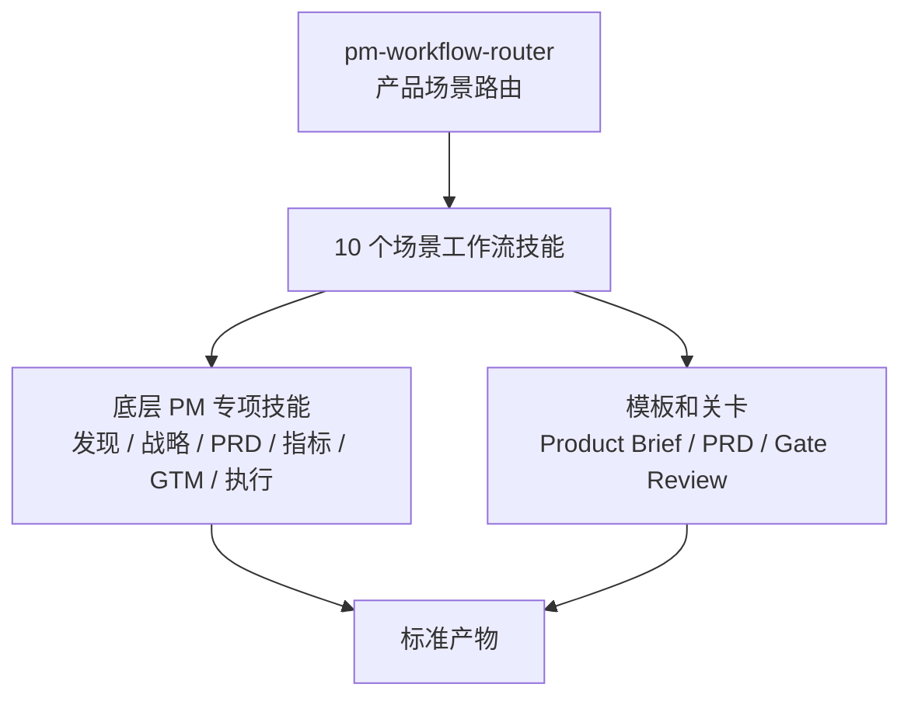

# 产品经理插件化场景工作流设计

本文档修正前面方案的方向：目标不是写一套提示词手册，而是把产品经理高频工作场景做成 Codex 插件能力，类似 `superpowers` 对研发工作的组织方式。

未来用户使用的不是“复制某段 prompt”，而是安装一个产品经理插件。用户只要描述当前产品工作，插件自动判断场景、调用对应技能流、按阶段生成标准产物，并在没想清楚时阻断下一步。

## 核心判断

更合适的形态是“场景化 PM 插件”，不是“提示词库”。

原因：

1. 产品新人不知道该用哪个技能，插件必须自动路由。
2. 产品工作需要过程约束，不只是一次性生成文档。
3. 产品产物需要标准化，方便评审、交接、沉淀和下游 UI/研发消费。
4. 很多产品问题的正确动作是“先阻断并追问”，不是“继续生成”。
5. 插件可以把场景、技能流、模板、关卡和学习材料封装在一起，降低个人能力差异。

## 插件应该解决什么

这个插件的定位不是“帮我写 PRD”，而是“公司产品工作操作系统”。

它应该负责：

- 判断用户当前处于哪个产品工作场景。
- 选择合适的产品技能流。
- 按阶段推进工作，而不是直接跳到最终文档。
- 生成统一结构的产品产物。
- 在信息不足时阻断下一步。
- 让新人通过场景理解产品工作，而不是先背技能名。
- 为 UI 智能体和研发智能体提供可消费的上游输入。

## 插件能力模型

推荐插件名字：

```text
pm-superpowers
```

或：

```text
product-superpowers
```

插件内部不是简单搬运 68 个 PM skills，而是分成三层。



三层说明：

| 层级 | 插件内形态 | 作用 |
| --- | --- | --- |
| 路由层 | `pm-workflow-router` skill | 用户发起任何产品任务时先判断场景，选择工作流 |
| 场景工作流层 | 10 个 workflow skills | 封装每个高频场景的步骤、技能调用顺序、关卡和输出 |
| 专项能力层 | 现有 PM skills 或内置 references | 提供具体方法，如 PRD、假设识别、指标、竞品、GTM |

这和 `superpowers` 的思路一致：用户不是手动选择每个研发动作，而是由技能体系告诉智能体什么时候 brainstorming、什么时候 writing-plans、什么时候 TDD、什么时候 verification。

PM 插件也应如此：用户不是手动选择 `create-prd`、`prioritize-assumptions`、`metrics-dashboard`，而是由场景工作流自动组合。

## 推荐插件结构

```text
pm-superpowers/
  .codex-plugin/
    plugin.json
  skills/
    pm-workflow-router/
      SKILL.md
      references/
        scene-taxonomy.md
        routing-rules.md
    new-product-discovery/
      SKILL.md
      references/
        gates.md
        output-spec.md
    existing-product-optimization/
      SKILL.md
      references/
        gates.md
        output-spec.md
    feedback-to-roadmap/
      SKILL.md
      references/
        gates.md
        output-spec.md
    prd-standardization/
      SKILL.md
      references/
        prd-template.md
        ready-checklist.md
    user-research/
      SKILL.md
      references/
        interview-guide.md
        synthesis-rules.md
    prioritization-roadmap/
      SKILL.md
      references/
        prioritization-frameworks.md
        roadmap-template.md
    metrics-experiments/
      SKILL.md
      references/
        metric-taxonomy.md
        experiment-gates.md
    strategy-business-model/
      SKILL.md
      references/
        strategy-canvas.md
        market-scan.md
    launch-readiness/
      SKILL.md
      references/
        launch-checklist.md
        risk-taxonomy.md
    pm-operations/
      SKILL.md
      references/
        meeting-notes.md
        okr-template.md
  assets/
    templates/
      product-brief.md
      discovery-pack.md
      prd.md
      gate-review.md
      roadmap.md
      metrics-plan.md
      launch-checklist.md
```

关键点：

- `pm-workflow-router` 应该像 `using-superpowers` 一样，作为 PM 工作入口优先触发。
- 10 个场景技能应该像 `writing-plans`、`test-driven-development` 一样，包含强流程和强关卡。
- 现有 68 个 PM skills 可以作为底层能力来源，但不应该直接暴露给新人。
- 模板要做成 assets 或 references，让输出稳定。

## 十个场景应该如何在插件里表达

下面不是提示词，而是插件能力设计。每个场景都应该是一个可以自动触发的 workflow skill。

## S1：新产品/新想法探索

### 给用户的通俗解释

当你只有一个新想法，或者公司想探索一个新方向时，不应该立刻写 PRD。这个阶段的核心任务是判断“这个东西是否值得做”。你要先弄清楚目标用户、真实问题、替代方案、关键假设和验证方式。

它解决的问题是：避免团队因为一个听起来不错的想法，就投入设计和研发。

### 用户常见入口

- 我们想做一个新产品。
- 老板提出了一个新方向。
- 我有一个 AI 产品想法。
- 我想验证某个市场机会。

### 插件应触发的 workflow skill

```text
new-product-discovery
```

### 背后技能流

```text
brainstorm-ideas-new
-> identify-assumptions-new
-> prioritize-assumptions
-> brainstorm-experiments-new
-> value-proposition
-> lean-canvas 或 startup-canvas
-> create-prd
-> test-scenarios
```

### 工作流逻辑

1. 先判断这是新产品还是已有产品优化。
2. 如果是新产品，先建立 Product Brief。
3. 发散可能方案，但不直接定方案。
4. 找出最可能导致失败的假设。
5. 为关键假设设计验证实验。
6. 只有当核心用户、问题、价值和验证路径清楚后，才允许进入 MVP PRD。

### 插件关卡

必须阻断的情况：

- 用户是谁不清楚。
- 用户问题不清楚。
- 没有替代方案分析。
- 没有关键假设。
- 没有验证计划。
- 用户要求直接写 PRD，但前置信息不足。

### 标准产物

- Product Brief
- Assumption Map
- Experiment Plan
- Value Proposition
- MVP PRD
- Test Scenarios

### 新人应该学到什么

新产品探索不是“想功能”，而是“验证一个产品是否应该存在”。

## S2：已有产品问题优化

### 给用户的通俗解释

当一个已有功能不好用、指标下降、用户反馈差时，不要马上说“改页面”或“加功能”。这个场景要先诊断问题：到底是哪个用户、哪个流程、哪个环节出了问题，再决定用什么方案优化。

它解决的问题是：避免把症状当原因，把第一个方案当答案。

### 用户常见入口

- 这个功能用户不会用。
- 首页转化率下降。
- Onboarding 完成率太低。
- 某个流程体验不好。
- 用户说这个页面很难用。

### 插件应触发的 workflow skill

```text
existing-product-optimization
```

### 背后技能流

```text
opportunity-solution-tree
-> identify-assumptions-existing
-> brainstorm-ideas-existing
-> brainstorm-experiments-existing
-> prioritize-features
-> create-prd
-> test-scenarios
```

### 工作流逻辑

1. 先把“想改什么”转成“用户在哪个场景遇到什么问题”。
2. 梳理现象、证据、影响用户和业务指标。
3. 构建机会解决方案树。
4. 生成多个方案，而不是只接受第一个方案。
5. 排序方案并设计验证方式。
6. 输出改进 PRD。

### 插件关卡

必须阻断的情况：

- 只有方案，没有问题定义。
- 只有主观判断，没有用户或数据证据。
- 没有当前基线指标。
- 不知道要改善哪个用户行为。

### 标准产物

- Problem Definition
- Evidence Summary
- Opportunity Solution Tree
- Solution Options
- Improvement PRD

### 新人应该学到什么

已有产品优化的第一步是诊断，不是改 UI 或加功能。

## S3：客户反馈和功能请求整理

### 给用户的通俗解释

客户、销售、客服会提出很多需求，但这些需求不能直接变成路线图。产品经理要把反馈变成结构化证据：哪些是真问题，哪些是定制诉求，哪些代表目标市场，哪些值得进入路线图。

它解决的问题是：避免谁声音大就先做谁的需求。

### 用户常见入口

- 销售反馈很多客户想要某功能。
- 客服收集了一批问题。
- 需求池太乱了。
- 帮我整理客户反馈。
- 这些功能请求哪些应该做？

### 插件应触发的 workflow skill

```text
feedback-to-roadmap
```

### 背后技能流

```text
analyze-feature-requests
-> sentiment-analysis
-> user-segmentation
-> prioritize-features
-> outcome-roadmap
```

### 工作流逻辑

1. 标准化反馈来源、客户类型、频次和原文。
2. 聚类主题。
3. 提炼真实诉求。
4. 识别用户群体和客户价值差异。
5. 做优先级排序。
6. 形成结果导向路线图。

### 插件关卡

必须阻断的情况：

- 没有反馈来源。
- 没有频次或客户影响范围。
- 没有业务目标。
- 反馈只是二手转述，缺少原文或上下文。
- 用户要求直接排期，但没有资源约束。

### 标准产物

- Feedback Analysis
- Theme Clusters
- Segment Insights
- Prioritization Matrix
- Outcome Roadmap

### 新人应该学到什么

客户反馈是输入，不是决策。产品经理要把反馈转成证据、判断和取舍。

## S4：写 PRD/需求文档

### 给用户的通俗解释

PRD 不是把想做的功能写出来，而是把“为什么做、给谁做、做什么、不做什么、怎么验收”讲清楚。PRD 是产品、设计、研发、测试之间的契约。

它解决的问题是：避免模糊需求直接进入设计和研发。

### 用户常见入口

- 帮我写个需求。
- 我要给研发提需求。
- 把这个功能写成 PRD。
- 这个需求要排期。

### 插件应触发的 workflow skill

```text
prd-standardization
```

### 背后技能流

```text
create-prd
-> user-stories
-> job-stories 或 wwas
-> test-scenarios
-> pre-mortem
```

### 工作流逻辑

1. 先做 PRD Ready Check。
2. 如果用户、问题、目标、范围、指标不清楚，阻断。
3. 信息足够后，生成 PRD。
4. 拆成用户故事、验收标准和测试场景。
5. 做风险预演。
6. 输出可以给 UI 和研发消费的需求包。

### 插件关卡

必须阻断的情况：

- 目标用户不清楚。
- 用户问题不清楚。
- 成功指标不清楚。
- 范围内/范围外不清楚。
- 没有验收标准。
- 需求只描述方案，没有背景和目标。

### 标准产物

- PRD
- User Stories
- Acceptance Criteria
- Test Scenarios
- Risk Notes

### 新人应该学到什么

PRD 的质量不在文字长短，而在下游能否据此设计、开发、测试和验收。

## S5：用户研究和访谈

### 给用户的通俗解释

用户研究不是问用户“你想不想要这个功能”，而是理解用户过去的行为、当前的任务、痛点、替代方案和决策过程。

它解决的问题是：避免团队用想象代替用户事实。

### 用户常见入口

- 我要访谈用户。
- 帮我写访谈提纲。
- 帮我总结访谈。
- 用户为什么不用这个功能？
- 我想知道客户怎么做采购决策。

### 插件应触发的 workflow skill

```text
user-research
```

### 背后技能流

```text
interview-script
-> summarize-interview
-> user-personas
-> user-segmentation
```

### 工作流逻辑

1. 先明确研究要支持什么决策。
2. 明确访谈对象和筛选条件。
3. 生成非引导式访谈提纲。
4. 访谈后提炼 JTBD、痛点、替代方案和原话证据。
5. 必要时形成用户画像或分群。

### 插件关卡

必须阻断的情况：

- 不知道研究要支持什么决策。
- 不知道访谈对象是谁。
- 访谈问题是引导性的。
- 用户只想问“你喜不喜欢这个方案”。
- 总结没有用户原话或证据。

### 标准产物

- Research Goal
- Interview Script
- Interview Summary
- JTBD Insights
- Personas or Segments

### 新人应该学到什么

访谈不是让用户替你设计产品，而是帮你理解真实场景和真实行为。

## S6：功能优先级和路线图

### 给用户的通俗解释

优先级不是把所有需求按主观感觉排序，而是在资源有限时做取舍。路线图也不应该只是功能列表，而应该说明每个阶段要达成什么结果。

它解决的问题是：避免路线图变成“谁声音大谁先做”的排队表。

### 用户常见入口

- 这么多功能先做哪个？
- 下季度路线图怎么排？
- 资源不够怎么取舍？
- 老板、销售、客户都要不同东西。

### 插件应触发的 workflow skill

```text
prioritization-roadmap
```

### 背后技能流

```text
prioritization-frameworks
-> prioritize-features
-> outcome-roadmap
-> stakeholder-map
```

### 工作流逻辑

1. 先确认业务目标和规划周期。
2. 统一候选项描述。
3. 选择优先级框架。
4. 定义评分口径。
5. 排序并说明取舍理由。
6. 转成 outcome roadmap。
7. 识别相关方和沟通策略。

### 插件关卡

必须阻断的情况：

- 没有业务目标。
- 没有统一评分口径。
- 候选项定义不清楚。
- 没有资源约束。
- 只要求排期，不说明取舍。

### 标准产物

- Prioritization Matrix
- Decision Rationale
- Outcome Roadmap
- Stakeholder Plan

### 新人应该学到什么

优先级的本质是取舍。路线图要表达结果，不只是功能。

## S7：指标和增长实验

### 给用户的通俗解释

指标体系不是把所有数据都列出来，而是找到能代表用户价值和业务结果的少数关键指标。增长实验也不是试试看，而是有假设、有样本、有周期、有决策标准。

它解决的问题是：避免团队只看功能交付，不看产品结果。

### 用户常见入口

- 我们该看什么指标？
- 北极星指标怎么定？
- 这个实验能不能上线？
- 留存下降怎么分析？
- 帮我写 SQL 看这个指标。

### 插件应触发的 workflow skill

```text
metrics-experiments
```

### 背后技能流

```text
north-star-metric
-> metrics-dashboard
-> sql-queries
-> cohort-analysis
-> brainstorm-experiments-existing
-> ab-test-analysis
```

### 工作流逻辑

1. 判断产品业务类型。
2. 定义北极星指标。
3. 拆输入指标、健康指标和护栏指标。
4. 设计看板和口径。
5. 需要时生成 SQL。
6. 设计实验。
7. 分析实验结果并给出 ship、extend 或 stop 建议。

### 插件关卡

必须阻断的情况：

- 指标不能代表用户价值。
- 没有指标口径。
- 没有当前基线。
- 实验没有样本量、周期或决策标准。
- A/B 测试没有显著性分析就要求上线。

### 标准产物

- North Star Metric
- Metrics Dashboard Spec
- SQL Queries
- Experiment Plan
- Experiment Analysis

### 新人应该学到什么

指标是产品决策工具，不是报表装饰。

## S8：产品战略和商业模式

### 给用户的通俗解释

产品战略不是愿景口号，也不是一堆想做的功能。它要回答：服务谁、创造什么价值、为什么能赢、怎么赚钱、做什么、不做什么。

它解决的问题是：避免团队在方向不清时就进入执行。

### 用户常见入口

- 这个方向值不值得做？
- 我们的产品战略是什么？
- 商业模式怎么定？
- 这个市场有多大？
- 怎么和竞品区分？
- 定价应该怎么做？

### 插件应触发的 workflow skill

```text
strategy-business-model
```

### 背后技能流

```text
product-vision
-> product-strategy
-> value-proposition
-> market-sizing
-> competitor-analysis
-> business-model
-> pricing-strategy
-> swot-analysis / pestle-analysis / porters-five-forces / ansoff-matrix
```

### 工作流逻辑

1. 先明确这次战略问题。
2. 定义目标用户和价值主张。
3. 分析市场规模、竞品和替代方案。
4. 选择商业模式和定价方向。
5. 明确战略取舍。
6. 输出产品战略画布，并可转成 OKR 和 roadmap。

### 插件关卡

必须阻断的情况：

- 不知道目标市场。
- 不知道目标用户。
- 不知道用户替代方案。
- 只是泛泛分析，没有战略问题。
- 战略不能说明“不做什么”。

### 标准产物

- Product Vision
- Product Strategy Canvas
- Value Proposition
- Market Scan
- Business Model
- Pricing Direction
- Strategic Trade-offs

### 新人应该学到什么

战略是选择和取舍，不是愿望清单。

## S9：上线发布和风险检查

### 给用户的通俗解释

上线不是研发说做完就结束。产品经理要确认用户影响、风险、测试、监控、回滚、发布说明和相关方沟通都准备好。

它解决的问题是：避免功能完成但上线失控。

### 用户常见入口

- 准备上线了，帮我检查。
- 这个功能下周发布。
- 帮我写发布说明。
- 上线有什么风险？
- 这个需求能不能发？

### 插件应触发的 workflow skill

```text
launch-readiness
```

### 背后技能流

```text
pre-mortem
-> strategy-red-team
-> test-scenarios
-> stakeholder-map
-> release-notes
```

### 工作流逻辑

1. 对照 PRD 和验收标准检查完成度。
2. 做上线失败预演。
3. 红队挑战关键假设。
4. 检查测试覆盖和边界场景。
5. 制定相关方沟通计划。
6. 输出发布说明、监控和回滚计划。

### 插件关卡

必须阻断的情况：

- 有 launch-blocking 风险。
- 核心路径未测试。
- 没有回滚方案。
- 没有监控指标。
- 关键相关方未同步。

### 标准产物

- Launch Risk Review
- Test Coverage Notes
- Stakeholder Plan
- Release Notes
- Launch Checklist

### 新人应该学到什么

上线的标准不是“做完”，而是“可用、可控、可监控、可回滚”。

## S10：PM 日常运转

### 给用户的通俗解释

PM 日常工作包括会议纪要、OKR、Sprint、复盘、行动项和决策记录。它看起来琐碎，但决定团队执行质量。

它解决的问题是：避免决策和行动项散落在聊天记录里。

### 用户常见入口

- 帮我整理会议纪要。
- 帮我写 OKR。
- 下个 Sprint 怎么排？
- 帮我做复盘。
- 生成一些测试数据。

### 插件应触发的 workflow skill

```text
pm-operations
```

### 背后技能流

```text
summarize-meeting
-> brainstorm-okrs
-> sprint-plan
-> retro
-> dummy-dataset
```

### 工作流逻辑

1. 判断输入属于会议、OKR、Sprint、复盘还是数据。
2. 结构化输出对应产物。
3. 提取决策、行动项、owner 和 deadline。
4. 对影响路线图或 PRD 的事项写入 decision log。

### 插件关卡

必须阻断的情况：

- 会议纪要没有决策和行动项。
- 行动项没有 owner。
- OKR 没有可衡量 KR。
- Sprint 没有容量、依赖和风险。
- 复盘没有后续行动。

### 标准产物

- Meeting Notes
- OKRs
- Sprint Plan
- Retro Actions
- Decision Log

### 新人应该学到什么

PM 日常工作的核心是让决策、责任、时间和后续行动变清楚。

## 路由技能应该怎么设计

`pm-workflow-router` 是插件最重要的技能。它不是业务技能，而是流程控制技能。

它的职责：

1. 在任何 PM 相关任务开始前触发。
2. 判断用户属于 S1 到 S10 哪个场景。
3. 给出置信度和判断依据。
4. 调用对应场景 workflow skill。
5. 如果信息不足，阻断并追问。
6. 禁止直接跳到 PRD、UI 或研发。

建议 `SKILL.md` frontmatter：

```yaml
---
name: pm-workflow-router
description: Use at the start of any product management task to classify the scenario, select the correct PM workflow, and enforce gates before generating PRDs, roadmaps, metrics, launch plans, or handoffs.
---
```

路由输出不应该是提示词，而应该是流程状态：

```markdown
## Scenario
- Selected:
- Confidence:
- Reason:

## Workflow
- Skill:
- Steps:
- Expected artifacts:

## Gate
- Result: PASS / PASS_WITH_RISKS / BLOCKED
- Missing:
- Required next input:
```

## 场景技能应该怎么设计

每个场景技能都要具备同样结构。

```markdown
---
name: new-product-discovery
description: Use when exploring a new product idea or market opportunity before PRD, UI, or engineering. Guides PM through user/problem clarity, assumptions, experiments, value proposition, MVP scope, and gates.
---

# New Product Discovery

## When to use
...

## Hard gates
...

## Workflow
...

## Output artifacts
...

## Downstream readiness
...
```

关键设计：

- SKILL.md 本体保持短，只放流程骨架和强约束。
- 详细模板放 `references/` 或 `assets/templates/`。
- 关卡规则放 `references/gates.md`。
- 输出格式放 `references/output-spec.md`。

## 为什么不是继续扩展提示词

提示词适合个人临时使用，不适合公司流程标准化。插件化更合适，因为：

| 提示词方式 | 插件方式 |
| --- | --- |
| 用户要知道用哪段提示词 | 用户只描述任务，插件自动路由 |
| 依赖个人理解 | 流程固化在 skill 内 |
| 难以强制阻断 | 可以在 skill 中写 hard gate |
| 输出容易不一致 | 模板和产物结构统一 |
| 不适合新人 | 新人按场景学习即可 |
| 难与 UI/研发串联 | 可以输出标准 handoff |

## 未来和 UI/研发智能体的连接

PM 插件第一阶段只负责产品场景工作流，但产物结构要为后续串联做准备。

PM 插件输出：

```text
Product Brief
Discovery Pack
PRD
User Stories
Acceptance Criteria
Metrics Plan
Launch Checklist
```

UI 插件消费：

```text
PRD
User Stories
Acceptance Criteria
Target User
Core Flow
Scope / Non-goals
```

研发插件消费：

```text
PRD
UI Spec
Acceptance Criteria
Test Scenarios
Data / Permission Rules
```

因此 PM 插件必须有一个 `downstream-readiness` 检查：

- 是否可以进入 UI？
- 是否可以进入研发？
- 还缺什么？
- 缺失信息由谁补？

## 推荐落地顺序

### 阶段 1：先做路由和 5 个 P0 场景

先实现：

1. `pm-workflow-router`
2. `new-product-discovery`
3. `feedback-to-roadmap`
4. `prd-standardization`
5. `prioritization-roadmap`
6. `launch-readiness`

原因：

- 覆盖新人最高频误用场景。
- 最能建立“不能没想清楚就下一步”的纪律。
- 产物最容易被 UI 和研发消费。

### 阶段 2：补齐剩余 5 个场景

补充：

1. `existing-product-optimization`
2. `user-research`
3. `metrics-experiments`
4. `strategy-business-model`
5. `pm-operations`

### 阶段 3：把现有 68 个 PM skills 作为底层能力接入

做法：

- 不直接让用户选 68 个技能。
- 每个场景 skill 内部说明该使用哪些底层 PM skills。
- 对新人只展示场景入口。
- 对高级 PM 可以展示底层技能清单。

### 阶段 4：做团队模板和案例库

插件应包含：

- Product Brief 模板
- Discovery Pack 模板
- PRD 模板
- Gate Review 模板
- Roadmap 模板
- Metrics Plan 模板
- Launch Checklist 模板
- 每个场景 1 个优秀案例和 1 个阻断案例

## 最终形态

理想使用体验：

1. 用户安装 `pm-superpowers`。
2. 用户说：“我们想做一个面向销售的 AI 客户跟进助手。”
3. `pm-workflow-router` 自动判断为 S1。
4. 自动进入 `new-product-discovery`。
5. 插件发现目标用户、问题、假设不清楚，先阻断并追问。
6. 信息补齐后，自动输出 Product Brief、Assumption Map、Experiment Plan。
7. 通过 Gate 后，才允许生成 MVP PRD。
8. PRD 达标后，输出 UI/研发可消费的 handoff。

这才是适合公司推广的产品经理插件形态。

## 当前文档结论

前面写的场景手册可以保留为“学习材料”，但不应作为最终产品形态。真正要建设的是：

- 一个 PM 插件。
- 一个强制路由技能。
- 十个场景工作流技能。
- 一组标准模板。
- 一套 Gate Review 机制。
- 一个面向新人的场景学习层。

也就是说：学习材料帮助大家理解场景，插件负责把理解变成可执行、可约束、可交付的工作流。

## 圆桌评审后的修正

详见：[PM_PLUGIN_ROUNDTABLE_REVIEW.md](PM_PLUGIN_ROUNDTABLE_REVIEW.md)

圆桌评审后，需要对本插件方案做一个重要修正：十个高频 PM 场景适合作为“用户学习层”和“场景入口”，但不应该直接等同于插件的完整技能结构。真正可靠的插件还需要一组横切流程控制技能。

建议插件结构从：

```text
路由技能 + 10 个场景工作流技能
```

升级为：

```text
路由技能 + 入口治理技能 + 核心场景工作流技能 + 横切控制技能 + 标准模板
```

新增的关键技能：

| 技能 | 类型 | 作用 |
| --- | --- | --- |
| `pm-intake-triage` | 入口治理 | 在进入十个场景前，先判断请求来源、请求类型、证据质量和应该路由到哪里 |
| `pm-gate-review` | 横切关卡 | 统一判断是否能进入下一阶段，输出 `PASS`、`PASS_WITH_RISKS` 或 `BLOCKED` |
| `evidence-classifier` | 横切判断 | 区分事实、用户原话、信号、假设、观点和承诺 |
| `pm-decision-log` | 横切记录 | 记录为什么做、为什么不做、谁决定、基于什么证据、何时复查 |
| `downstream-readiness` | 交接检查 | 判断是否可以交给 UI 或研发，缺哪些用户流、状态、权限、验收标准和指标 |
| `post-launch-learning` | 闭环学习 | 上线后检查指标、反馈、假设验证结果和后续动作 |

推荐 MVP 不要一次做完 10 个场景。第一版先做 8 个高价值技能：

1. `pm-workflow-router`
2. `pm-intake-triage`
3. `pm-gate-review`
4. `evidence-classifier`
5. `new-product-discovery`
6. `feedback-to-roadmap`
7. `prd-standardization`
8. `launch-readiness`

这会让插件先建立“正确入口 + 强关卡 + 高频产物”的纪律，再逐步扩展到全部场景。
