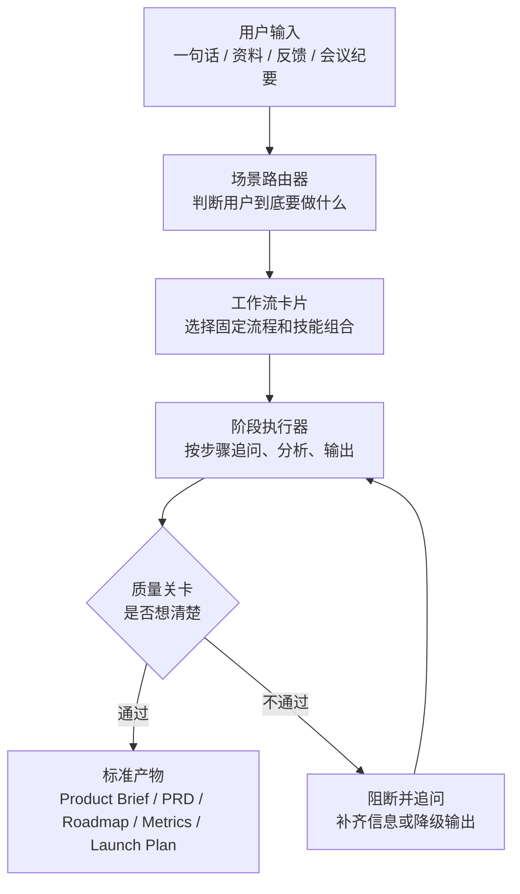

# PM 场景工作流体系方案

本文档聚焦一个问题：如何让刚接触产品工作的人，或者公司所有产品经理，在不同产品场景下自动选择正确工作流、按规范输出结果，并且在没想清楚时不能跳到下一步。

核心结论：公司不应该直接让大家面对 68 个技能，而应该提供一个“场景入口”。用户只描述自己要做什么，系统自动判断场景、选择工作流、逐步追问、生成标准产物，并在关键节点做关卡判断。

## 设计目标

这套体系要同时满足四件事：

1. 学得会：新人能先理解“产品工作有哪些场景”，而不是先背技能名。
2. 用得上：每个场景都有固定步骤、输入要求、输出模板和示例。
3. 管得住：关键信息没想清楚时，工作流必须阻断，不允许继续写 PRD、排期或进入 UI/研发。
4. 可复制：不同 PM、不同团队产出的文档结构一致，方便评审、交接、复盘和沉淀。

## 总体机制

推荐把系统拆成四层：



四层职责：

| 层级 | 作用 | 解决的问题 |
| --- | --- | --- |
| 场景路由器 | 判断用户处在哪类产品工作场景 | 用户不知道该用什么技能、该走什么流程 |
| 工作流卡片 | 为每个场景定义固定步骤、技能、产物和关卡 | 防止每个人临时发挥 |
| 阶段执行器 | 按步骤推进、追问、分析和生成中间产物 | 防止直接跳到最终文档 |
| 质量关卡 | 检查是否满足进入下一步的条件 | 防止没想清楚就写 PRD、做 UI、交给研发 |

## 场景优先，而不是技能优先

新人和多数同事不应该先学习 `create-prd`、`opportunity-solution-tree`、`prioritize-assumptions` 这些技能名。他们应该先学习这些问题：

- 我现在是在探索一个新想法，还是在优化已有产品？
- 我现在是在理解问题，还是已经准备写需求？
- 我现在要做战略、路线图、PRD、指标、上线，还是复盘？
- 我现在缺的是用户证据、业务目标、方案设计、优先级，还是验收标准？

因此对用户暴露的入口应该是“场景”，不是“技能”。

## 产品场景分类

建议先标准化 10 个高频场景。

| 编号 | 场景 | 用户常见说法 | 应该进入的工作流 | 主要产物 |
| --- | --- | --- | --- | --- |
| S1 | 新产品/新想法探索 | “我有个想法”“我们能不能做一个...” | 新想法到 MVP PRD | Discovery Pack、假设清单、实验计划、MVP PRD |
| S2 | 已有产品问题优化 | “这个指标不好”“用户说不好用”“想优化某功能” | 问题诊断到改进方案 | 问题定义、机会树、方案优先级、改进 PRD |
| S3 | 客户反馈和功能请求整理 | “客户提了很多需求”“销售反馈一堆问题” | 反馈到路线图 | 反馈聚类、用户分群、优先级、结果导向路线图 |
| S4 | 写 PRD/需求文档 | “帮我写需求”“我要给研发提需求” | PRD 标准化 | PRD、用户故事、验收标准、测试场景 |
| S5 | 用户研究和访谈 | “我要访谈用户”“这段访谈帮我总结” | 访谈准备和洞察沉淀 | 访谈提纲、JTBD 洞察、行动项 |
| S6 | 功能优先级和路线图 | “功能太多怎么排”“下季度做什么” | 优先级到路线图 | 优先级矩阵、取舍说明、Outcome Roadmap |
| S7 | 指标和增长实验 | “该看什么指标”“实验结果怎么看” | 指标体系和实验分析 | 北极星指标、看板、SQL、实验结论 |
| S8 | 产品战略和商业模式 | “这个方向是否值得做”“商业模式怎么定” | 战略扫描和商业建模 | 产品战略、价值主张、市场扫描、商业模式 |
| S9 | 上线发布和风险检查 | “准备上线”“发布前帮我检查” | 发布准备 | 风险预案、stakeholder map、发布说明 |
| S10 | PM 日常运转 | “会议纪要”“OKR”“Sprint 复盘” | PM 运营工作流 | 会议纪要、OKR、Sprint 计划、复盘行动项 |

## 场景路由器设计

场景路由器是整个体系的入口。它的目标不是马上输出答案，而是先做判断。

### 路由器输入

用户可以输入任意形式：

- 一句话想法
- 一段需求
- 客户反馈列表
- 数据现象
- 会议纪要
- PRD 草稿
- 老板或客户提出的目标
- 准备上线的功能描述

### 路由器输出格式

```markdown
## 场景判断
- 推荐场景：
- 置信度：
- 判断依据：
- 可能的备选场景：

## 推荐工作流
- 工作流名称：
- 适用原因：
- 预计产物：
- 预计步骤：

## 当前缺失信息
- 缺失信息 1：
- 缺失信息 2：

## 下一步
- 如果信息足够：进入第 1 步
- 如果信息不足：先追问，不进入下一步
```

### 路由规则

| 判断信号 | 路由到 |
| --- | --- |
| 输入是一个模糊想法，缺用户和问题证据 | S1 新产品/新想法探索 |
| 输入包含“用户反馈、投诉、体验差、转化低、留存低” | S2 已有产品问题优化 |
| 输入是一批需求、工单、销售反馈、客户列表 | S3 客户反馈和功能请求整理 |
| 输入要求“写 PRD、写需求、给研发” | S4 写 PRD/需求文档 |
| 输入包含“访谈、调研、用户研究、问卷、访谈记录” | S5 用户研究和访谈 |
| 输入包含“优先级、排期、路线图、资源有限” | S6 功能优先级和路线图 |
| 输入包含“指标、增长、实验、A/B、SQL、留存” | S7 指标和增长实验 |
| 输入包含“战略、市场、竞品、商业模式、定价” | S8 产品战略和商业模式 |
| 输入包含“上线、发布、风险、发布说明、检查” | S9 上线发布和风险检查 |
| 输入包含“会议、OKR、Sprint、复盘、周会” | S10 PM 日常运转 |

### 置信度策略

- 置信度高于 0.8：直接推荐工作流，并说明理由。
- 置信度 0.5 到 0.8：给出推荐工作流，同时列出 1 个备选场景，请用户确认。
- 置信度低于 0.5：不进入工作流，先问 2 到 3 个澄清问题。

## 关卡机制：没想清楚不能下一步

每个工作流都要有明确的关卡。关卡输出只能有三种：

| 结果 | 含义 | 下一步 |
| --- | --- | --- |
| PASS | 信息足够，质量达标 | 进入下一阶段 |
| PASS_WITH_RISKS | 可以继续，但必须标记风险 | 进入下一阶段，同时写入风险清单 |
| BLOCKED | 关键信息缺失或逻辑不成立 | 停止，不生成下一阶段产物 |

### 通用阻断条件

出现以下任一情况，应该阻断：

- 不知道目标用户是谁。
- 不知道要解决什么用户问题。
- 业务目标不明确。
- 没有成功指标。
- 没有范围边界。
- 没有区分事实、假设和观点。
- 没有说明为什么现在要做。
- 没有验收标准，却要求进入研发。
- 没有用户流程和状态，却要求进入 UI。
- 风险明显但没有缓解方案。

### 通用关卡检查

```markdown
## Gate Review

### Gate Result
PASS / PASS_WITH_RISKS / BLOCKED

### 已满足
- ...

### 缺失或不清楚
- ...

### 必须补充的问题
1. ...
2. ...
3. ...

### 是否允许进入下一步
- 结论：
- 原因：
```

## 工作流卡片标准

每个场景都要做成统一格式的“工作流卡片”。

```markdown
# 工作流名称

## 适用场景
- 什么时候使用：
- 什么时候不要使用：

## 输入要求
- 最少输入：
- 推荐输入：

## 使用技能
- 技能 1：
- 技能 2：

## 步骤
1. ...
2. ...

## 阶段关卡
- Gate 1：
- Gate 2：

## 输出产物
- 文件 1：
- 文件 2：

## 示例提示词
...

## 常见失败原因
- ...
```

## 10 个核心工作流

### S1：新想法到 MVP PRD

适用场景：

- 用户只有一个产品想法。
- 还没有清楚的目标用户、场景、价值主张。
- 需要判断是否值得继续推进。

不要使用：

- 已经有明确 PRD，只是需要格式化。
- 只是做已有功能的小优化。

技能组合：

1. `brainstorm-ideas-new`
2. `identify-assumptions-new`
3. `prioritize-assumptions`
4. `brainstorm-experiments-new`
5. `value-proposition`
6. `lean-canvas` 或 `startup-canvas`
7. `create-prd`
8. `test-scenarios`

步骤：

1. 澄清产品想法、目标用户、使用场景和触发原因。
2. 发散可能方案。
3. 识别高风险假设。
4. 排序最关键假设。
5. 设计低成本验证实验。
6. 定义价值主张。
7. 写 MVP PRD。
8. 输出验收标准和测试场景。

阻断点：

- 目标用户不清楚时，不允许写 PRD。
- 核心问题不清楚时，不允许设计方案。
- 关键假设没有验证计划时，不允许定义 MVP 范围。
- 成功指标不清楚时，不允许进入交付。

标准产物：

- `product-space/01-discovery/assumptions.md`
- `product-space/01-discovery/experiments.md`
- `product-space/02-strategy/value-proposition.md`
- `product-space/03-requirements/mvp-prd.md`
- `product-space/03-requirements/test-scenarios.md`

新人学习重点：

- 新想法不是直接写功能，而是先判断用户、问题、假设和验证方式。

### S2：已有产品问题到改进 PRD

适用场景：

- 某个指标变差。
- 用户反馈体验不好。
- 已有功能需要优化。

技能组合：

1. `opportunity-solution-tree`
2. `identify-assumptions-existing`
3. `brainstorm-ideas-existing`
4. `brainstorm-experiments-existing`
5. `prioritize-features`
6. `create-prd`
7. `test-scenarios`

步骤：

1. 明确现象：哪个用户、哪个场景、哪个指标或反馈。
2. 区分症状、问题和机会。
3. 建立 Opportunity Solution Tree。
4. 发散解决方案。
5. 识别方案假设和风险。
6. 排序方案。
7. 写改进 PRD 和测试场景。

阻断点：

- 只有方案，没有问题定义时阻断。
- 只有主观判断，没有用户或数据证据时阻断。
- 没有当前基线指标时，不允许承诺改进效果。

标准产物：

- `product-space/01-discovery/problem-definition.md`
- `product-space/01-discovery/opportunity-solution-tree.md`
- `product-space/03-requirements/improvement-prd.md`

新人学习重点：

- 已有产品优化要先诊断问题，不要被第一个解决方案带跑。

### S3：客户反馈到路线图

适用场景：

- 有大量客户反馈、销售反馈、客服工单、需求池。
- 需要整理成路线图或优先级。

技能组合：

1. `analyze-feature-requests`
2. `sentiment-analysis`
3. `user-segmentation`
4. `prioritize-features`
5. `outcome-roadmap`

步骤：

1. 标准化反馈输入。
2. 聚类主题和真实诉求。
3. 按用户类型或客户价值分群。
4. 评估影响、成本、风险和战略匹配。
5. 输出结果导向路线图。

阻断点：

- 反馈没有来源或频次时，只能输出初步假设，不能输出强优先级。
- 没有业务目标时，不允许排路线图。
- 没有资源约束时，不做排期承诺。

标准产物：

- `product-space/01-discovery/feedback-analysis.md`
- `product-space/03-requirements/feature-prioritization.md`
- `product-space/03-requirements/outcome-roadmap.md`

新人学习重点：

- 客户说的功能请求只是输入，不等于产品决策。

### S4：PRD 标准化

适用场景：

- 用户已经有一个明确功能或问题。
- 需要形成给研发、设计、测试使用的 PRD。

技能组合：

1. `create-prd`
2. `user-stories`
3. `job-stories`
4. `wwas`
5. `test-scenarios`
6. `pre-mortem`

步骤：

1. 检查是否已具备 PRD 前置信息。
2. 生成 PRD。
3. 拆用户故事或 job stories。
4. 写验收标准。
5. 生成测试场景。
6. 做风险预演。

阻断点：

- 用户、问题、目标、范围、成功指标任一缺失时，不生成正式 PRD，只生成问题清单。
- 没有验收标准时，不允许进入研发。
- 范围外事项不清楚时，不允许评审通过。

标准产物：

- `product-space/03-requirements/prd.md`
- `product-space/03-requirements/user-stories.md`
- `product-space/03-requirements/acceptance-criteria.md`
- `product-space/03-requirements/test-scenarios.md`
- `product-space/03-requirements/risks.md`

新人学习重点：

- PRD 不是功能描述，而是问题、目标、范围、方案、指标、验收、风险的完整契约。

### S5：访谈准备和洞察沉淀

适用场景：

- 准备做用户访谈。
- 已有访谈记录，需要提炼洞察。

技能组合：

1. `interview-script`
2. `summarize-interview`
3. `user-personas`
4. `user-segmentation`

步骤：

1. 明确研究问题和决策用途。
2. 明确访谈对象和筛选条件。
3. 生成访谈提纲。
4. 访谈后总结 JTBD、痛点、替代方案和证据。
5. 提炼用户画像或分群。

阻断点：

- 不知道研究要服务哪个决策时，不允许生成访谈提纲。
- 访谈问题出现引导性时，必须重写。
- 访谈总结没有证据引用时，只能标记为假设。

标准产物：

- `product-space/01-discovery/interview-script.md`
- `product-space/01-discovery/interview-notes.md`
- `product-space/01-discovery/user-insights.md`

新人学习重点：

- 用户访谈不是问“你想不想要这个功能”，而是理解过去行为、真实场景和替代方案。

### S6：优先级和路线图

适用场景：

- 多个功能都想做，资源有限。
- 需要季度规划或路线图。

技能组合：

1. `prioritization-frameworks`
2. `prioritize-features`
3. `outcome-roadmap`
4. `stakeholder-map`

步骤：

1. 选择适合的优先级框架。
2. 明确评估维度。
3. 给每个候选项评分。
4. 输出排序和取舍理由。
5. 改写为 outcome roadmap。
6. 识别 stakeholder 和沟通计划。

阻断点：

- 没有业务目标，不允许排序。
- 没有统一评分口径，不允许比较。
- 没有资源约束，不允许承诺时间。

标准产物：

- `product-space/03-requirements/prioritization.md`
- `product-space/03-requirements/roadmap.md`
- `product-space/99-decisions/decision-log.md`

新人学习重点：

- 优先级不是谁声音大，而是目标、证据、成本、风险和战略取舍。

### S7：指标体系和增长实验

适用场景：

- 要定义产品指标。
- 要设计增长实验。
- 要分析 A/B 测试结果。

技能组合：

1. `north-star-metric`
2. `metrics-dashboard`
3. `sql-queries`
4. `cohort-analysis`
5. `ab-test-analysis`
6. `brainstorm-experiments-existing`

步骤：

1. 判断产品的业务游戏：Attention、Transaction、Productivity。
2. 定义北极星指标。
3. 拆输入指标、健康指标和护栏指标。
4. 设计看板。
5. 生成 SQL 或分析方案。
6. 设计实验。
7. 分析实验结果。

阻断点：

- 指标不能代表用户价值时，不允许设为北极星。
- 没有基线和时间窗口时，不允许判断增长效果。
- A/B 样本量或周期不足时，不允许给出 ship 结论。

标准产物：

- `product-space/03-requirements/metrics.md`
- `product-space/03-requirements/dashboard-spec.md`
- `product-space/03-requirements/experiment-plan.md`
- `product-space/06-release/experiment-analysis.md`

新人学习重点：

- 指标不是越多越好，要区分价值指标、过程指标和护栏指标。

### S8：战略和商业模式

适用场景：

- 判断产品方向是否值得做。
- 做年度规划、市场进入、商业模式或定价。

技能组合：

1. `product-strategy`
2. `product-vision`
3. `value-proposition`
4. `market-sizing`
5. `competitor-analysis`
6. `business-model`
7. `pricing-strategy`
8. `swot-analysis`
9. `pestle-analysis`
10. `porters-five-forces`

步骤：

1. 明确战略问题。
2. 定义愿景和目标用户。
3. 设计价值主张。
4. 评估市场规模和竞品。
5. 选择商业模式和定价方向。
6. 输出产品战略画布。

阻断点：

- 不知道目标市场时，不允许做市场规模估算。
- 不知道目标用户和替代方案时，不允许写价值主张。
- 战略不能说明“不做什么”时，不算通过。

标准产物：

- `product-space/02-strategy/product-strategy.md`
- `product-space/02-strategy/value-proposition.md`
- `product-space/02-strategy/market-scan.md`
- `product-space/02-strategy/business-model.md`

新人学习重点：

- 战略不是愿望清单，而是选择目标用户、价值、取舍和能力建设路径。

### S9：上线发布和风险检查

适用场景：

- 功能准备上线。
- 需要发布说明、风险预案、相关方同步。

技能组合：

1. `pre-mortem`
2. `strategy-red-team`
3. `stakeholder-map`
4. `release-notes`
5. `test-scenarios`

步骤：

1. 做 pre-mortem。
2. 红队挑战关键假设。
3. 生成 stakeholder map。
4. 检查测试场景。
5. 写发布说明。
6. 输出上线 checklist。

阻断点：

- 有 launch-blocking 风险时，不允许上线。
- 没有回滚方案时，不允许上线。
- 没有监控指标时，不允许上线。
- 重要相关方没有同步时，不允许上线。

标准产物：

- `product-space/03-requirements/release-risks.md`
- `product-space/06-release/release-notes.md`
- `product-space/06-release/launch-checklist.md`

新人学习重点：

- 上线不是开发完成，而是风险、监控、沟通和用户影响都准备好。

### S10：PM 日常运转

适用场景：

- 会议纪要、OKR、Sprint、复盘、测试数据等日常工作。

技能组合：

1. `summarize-meeting`
2. `brainstorm-okrs`
3. `sprint-plan`
4. `retro`
5. `dummy-dataset`

步骤：

1. 根据输入判断是会议、OKR、Sprint、复盘还是数据需求。
2. 使用对应技能生成结构化产物。
3. 提取行动项和 owner。
4. 如果涉及决策，写入 decision log。

阻断点：

- 会议纪要没有决策和行动项时，不算完成。
- OKR 没有可衡量 KR 时，不算完成。
- Sprint 计划没有容量、依赖和风险时，不算完成。

标准产物：

- `product-space/06-release/meeting-notes.md`
- `product-space/03-requirements/okrs.md`
- `product-space/03-requirements/sprint-plan.md`
- `product-space/06-release/retro.md`

新人学习重点：

- PM 日常工作也要沉淀决策、行动项和责任人。

## 自动选择工作流的交互方式

用户入口应该非常简单：

```text
我想做一个面向销售团队的客户跟进 AI 助手。
```

系统应该输出：

```markdown
## 场景判断
推荐场景：S1 新产品/新想法探索
置信度：0.86
判断依据：输入是新产品想法，缺少目标用户细分、核心场景、需求证据和验证计划。

## 推荐工作流
新想法到 MVP PRD

## 我会按以下步骤推进
1. 澄清目标用户和场景
2. 发散方案
3. 识别假设
4. 排序假设
5. 设计验证实验
6. 输出 MVP PRD

## 进入第 1 步前需要补充
1. 销售团队具体是哪类公司或岗位？
2. 当前客户跟进流程最大问题是什么？
3. 你希望这个产品优先解决效率、质量、转化率还是管理可视化？
```

如果用户说：

```text
帮我给研发写个需求：把首页改好看一点。
```

系统应该阻断：

```markdown
## Gate Result
BLOCKED

不能直接进入 PRD 或研发交付。

原因：
- “好看一点”不是可验收需求。
- 缺少目标用户、具体问题、当前页面问题、成功指标、范围和验收标准。

请先补充：
1. 首页当前要服务哪个核心任务？
2. 现在用户在哪一步遇到问题？
3. 你希望改版后哪个指标变化？
4. 哪些内容或模块必须保留？
```

## 标准输出规范

不同工作流可以产出不同文档，但都必须包含以下元信息：

```markdown
---
workflow:
scene:
status: draft | blocked | ready | approved
owner:
date:
version:
source_inputs:
---
```

每个正式产物必须包含：

- 背景
- 目标用户
- 问题定义
- 业务目标
- 用户目标
- 事实证据
- 关键假设
- 方案或建议
- 成功指标
- 范围内
- 范围外
- 风险
- open questions
- 下一步

## 学习体系设计

为了让同事真的学会，建议把学习材料分成三层。

### 第一层：场景地图

目标：让新人知道产品工作不是只有写需求。

内容：

- 10 个核心场景说明。
- 每个场景的典型输入。
- 每个场景的标准输出。
- 每个场景最常见误区。

### 第二层：工作流手册

目标：让新人知道每个场景怎么一步步推进。

每个工作流包含：

- 什么时候用。
- 不适合什么时候用。
- 需要什么输入。
- 用哪些技能。
- 每一步做什么。
- 每一步为什么重要。
- 过不了关卡怎么办。
- 完整示例。

### 第三层：案例库

目标：让新人通过例子建立判断力。

每个场景至少准备：

- 1 个优秀样例。
- 1 个低质量样例。
- 1 个被关卡阻断的样例。
- 1 个从阻断到补齐再通过的样例。

## 新人学习路径

建议新人按这个顺序学：

1. 产品工作全景：战略、发现、需求、指标、发布、复盘之间的关系。
2. 10 个产品场景：每个场景在什么时候出现。
3. 5 个高频工作流：新想法、反馈、PRD、优先级、发布。
4. 关卡机制：什么叫没想清楚，为什么不能下一步。
5. 标准产物：Product Brief、PRD、Roadmap、Metrics、Launch Plan。
6. 案例练习：对低质量输入做场景判断和阻断。

## 最小可落地版本

第一版不要做太大。建议先做 5 个工作流和 4 个模板。

### 先做 5 个工作流

| 优先级 | 工作流 | 原因 |
| --- | --- | --- |
| P0 | 新想法到 MVP PRD | 覆盖从 0 到 1，最能训练产品基本功 |
| P0 | 反馈到路线图 | 大多数团队都有反馈混乱问题 |
| P0 | PRD 标准化 | 直接影响研发协作质量 |
| P1 | 指标体系和增长实验 | 帮助从“做功能”转向“看结果” |
| P1 | 上线发布和风险检查 | 防止做完功能但上线质量不可控 |

### 先做 4 个模板

1. Product Brief
2. Discovery Pack
3. PRD
4. Gate Review

## 产品路由器初始提示词

可以把下面这段作为产品智能体的入口提示词。

```text
你是公司产品工作流路由器。你的首要任务不是直接回答问题，而是判断用户当前属于哪个产品工作场景，并选择合适的标准工作流。

你必须按以下顺序工作：
1. 识别场景：从 S1 到 S10 中选择最合适的场景。
2. 给出判断依据和置信度。
3. 选择对应工作流。
4. 判断当前输入是否足够进入第 1 步。
5. 如果不足，必须阻断并提出最多 3 个关键问题。
6. 如果足够，说明将使用哪些步骤和产出哪些文档。

你不能在以下情况直接写 PRD：
- 目标用户不清楚。
- 用户问题不清楚。
- 业务目标不清楚。
- 成功指标不清楚。
- 范围边界不清楚。

你不能在以下情况进入 UI 或研发：
- 没有验收标准。
- 没有核心用户流。
- 没有边界状态。
- 没有风险和依赖说明。

输出格式：
## 场景判断
## 推荐工作流
## 当前信息完整度
## Gate Result
## 下一步
```

## 公司级管理建议

### 对普通使用者

只暴露场景入口和工作流，不暴露完整技能清单。

### 对产品负责人

允许查看和调整工作流卡片、关卡标准、模板和案例库。

### 对高级 PM

允许自由组合技能，但最终产物必须通过公司统一 Gate Review。

### 对评审者

评审重点不是“文档写得好不好看”，而是：

- 是否选对场景。
- 是否按流程完成关键步骤。
- 是否在关键信息不足时被阻断。
- 是否有事实证据和假设区分。
- 是否能被下游 UI 和研发消费。

## 实施路线

### 第 1 周：定义标准

- 确认 10 个场景。
- 确认 5 个 P0/P1 工作流。
- 确认 Product Brief、Discovery Pack、PRD、Gate Review 模板。

### 第 2 周：制作工作流卡片

- 为每个 P0 工作流写完整卡片。
- 补齐阻断条件和示例。
- 制作新人学习材料第一版。

### 第 3 周：试点

- 选 2 到 3 个真实需求试跑。
- 记录哪些地方路由错误、追问不足、阻断过严或过松。
- 更新路由规则和关卡。

### 第 4 周：推广

- 在团队内要求所有新需求先过场景路由。
- 所有进入 UI/研发的需求必须附带 Gate Review。
- 建立案例库和常见问题。

## 最重要的原则

1. 先判断场景，再选择技能。
2. 先澄清问题，再设计方案。
3. 先识别假设，再写 PRD。
4. 先有验收标准，再交给 UI 或研发。
5. 先过关卡，再进入下一步。

如果只能记住一句话：这套体系的目标不是让大家更快写文档，而是让大家在没想清楚时停下来，把该想清楚的地方补齐。
