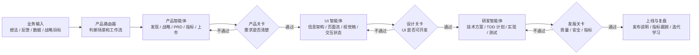

# 产品智能体工作流蓝图

本文档面向两个目标：

1. 让刚接触产品工作的新人，可以按场景使用稳定的产品工作流，而不是凭经验临时拼 prompt。
2. 让公司所有产品经理、UI 设计智能体、研发智能体之间形成统一交付链路：产品智能体负责需求和产品设计，UI 智能体负责界面方案打磨，研发智能体负责技术方案和实现。

核心判断：不要把体系设计成“技能大全”，而要设计成“场景路由 + 标准产物 + 阶段关卡 + 智能体交接协议”。

## 总体方案

推荐建设一个“产品空间 Product Space”，里面有三类智能体和六个阶段关卡。



三类智能体的边界要清楚：

| 智能体 | 核心职责 | 不应该做什么 | 主要输入 | 主要输出 |
| --- | --- | --- | --- | --- |
| 产品智能体 | 澄清问题、发现机会、梳理需求、制定指标、写 PRD、做风险分析 | 直接写 UI 细节和技术实现 | 业务目标、用户反馈、访谈、数据、竞品、战略约束 | Product Brief、Discovery Pack、PRD、用户故事、验收标准、指标方案 |
| UI 智能体 | 把产品意图转成可用、可开发、符合设计规范的界面方案 | 重新定义产品目标和业务优先级 | PRD、用户故事、用户旅程、品牌约束、组件库 | 用户流、信息架构、页面清单、UI 方案、交互状态、设计交接说明 |
| 研发智能体 | 把已确认的产品和 UI 方案转成技术方案、代码、测试和上线资产 | 擅自改变产品范围和交互承诺 | PRD、验收标准、UI spec、技术约束、现有代码 | 技术方案、实现计划、测试、代码、发版检查 |

## 产品空间目录建议

建议把所有产物沉淀在一个稳定目录中。以后无论是人还是智能体，都从这里读取上下文。

```text
product-space/
  00-intake/
    request.md
    context.md
  01-discovery/
    assumptions.md
    experiments.md
    interview-notes.md
    opportunity-solution-tree.md
  02-strategy/
    product-strategy.md
    value-proposition.md
    business-model.md
    market-scan.md
  03-requirements/
    prd.md
    user-stories.md
    acceptance-criteria.md
    metrics.md
    risks.md
  04-ui/
    ui-brief.md
    user-flows.md
    screen-spec.md
    interaction-states.md
    design-review.md
  05-dev-handoff/
    technical-brief.md
    implementation-plan.md
    test-plan.md
    api-contracts.md
  06-release/
    release-notes.md
    ship-check.md
    post-launch-review.md
  99-decisions/
    decision-log.md
    change-log.md
```

这套目录的价值是让每个智能体都以文件为事实来源，避免上下文散落在聊天记录里。

## 场景路由

产品智能体第一步不应该直接工作，而应该先判断任务属于哪个场景。推荐设置一个“产品路由器”。

| 场景 | 典型输入 | 推荐工作流 | 核心产物 |
| --- | --- | --- | --- |
| 0 到 1 新产品探索 | 一个新想法、一段战略目标、一个市场机会 | 新产品发现工作流 | Discovery Pack、假设优先级、实验计划、MVP PRD |
| 已有产品功能优化 | 用户反馈、业务指标下降、功能请求 | 机会和功能优先级工作流 | OST、功能优先级、PRD、验收标准 |
| 战略规划 | 年度目标、业务方向、竞品压力 | 产品战略工作流 | 产品战略画布、价值主张、商业模式、市场扫描 |
| 指标和增长 | 指标混乱、增长目标、实验结果 | 指标和实验工作流 | 北极星指标、看板、SQL、实验分析 |
| 上市发布 | 新功能待发布、新市场进入 | GTM 和发布工作流 | GTM 计划、ICP、发布说明、风险预案 |
| 研发交付前需求整理 | 模糊需求、PRD 草稿、会议纪要 | 需求标准化工作流 | PRD、用户故事、验收标准、测试场景 |
| AI 生成产品发版检查 | 已有代码、准备上线 | AI shipping 工作流 | 系统文档、安全审计、性能审计、测试覆盖地图 |
| PM 日常运营 | 会议、OKR、Sprint、复盘 | PM 运转工作流 | 会议纪要、OKR、路线图、Sprint 计划、复盘行动项 |

## 产品智能体最佳工作流

### 工作流 1：新产品从想法到 MVP PRD

适合刚有产品想法、创业项目、新业务探索。

步骤：

1. `brainstorm-ideas-new`：从 PM、设计、工程视角发散方案。
2. `identify-assumptions-new`：识别价值、可用性、可行性、商业、GTM、战略、团队等风险。
3. `prioritize-assumptions`：按影响和风险排序。
4. `brainstorm-experiments-new`：为高风险假设设计低成本实验。
5. `value-proposition`：明确用户、痛点、替代方案和结果。
6. `startup-canvas` 或 `lean-canvas`：形成业务假设。
7. `create-prd`：写 MVP PRD。
8. `test-scenarios`：补充验收测试场景。

关卡：

- 是否明确目标用户和核心场景？
- 是否列出最关键的未验证假设？
- 是否有低成本验证计划？
- PRD 是否明确范围内、范围外、成功指标、验收标准？

输出：

- `01-discovery/assumptions.md`
- `01-discovery/experiments.md`
- `02-strategy/value-proposition.md`
- `03-requirements/prd.md`
- `03-requirements/acceptance-criteria.md`

### 工作流 2：已有产品从反馈到路线图

适合已有产品迭代、客户需求很多、销售和客服反馈混杂。

步骤：

1. `analyze-feature-requests`：聚类反馈，识别主题和真实诉求。
2. `user-segmentation` 或 `sentiment-analysis`：判断不同用户群体的需求差异。
3. `opportunity-solution-tree`：从业务目标拆到机会、方案、实验。
4. `prioritize-features`：按影响、成本、风险、战略匹配度排序。
5. `outcome-roadmap`：把功能列表改写成结果导向路线图。
6. `create-prd`：为最高优先级功能写 PRD。

关卡：

- 是否区分了“用户说要什么”和“真实要解决的问题”？
- 是否有用户群体和业务价值证据？
- 路线图是否表达 outcome，而不是只有 feature list？

输出：

- `01-discovery/feedback-analysis.md`
- `01-discovery/opportunity-solution-tree.md`
- `03-requirements/roadmap.md`
- `03-requirements/prd.md`

### 工作流 3：产品战略到年度规划

适合公司级、产品线级、季度或年度规划。

步骤：

1. `product-vision`：形成愿景。
2. `product-strategy`：写 9 部分产品战略画布。
3. `market-sizing`：估算市场机会。
4. `competitor-analysis`：识别竞品和差异化。
5. `swot-analysis`、`pestle-analysis`、`porters-five-forces`、`ansoff-matrix`：做外部和内部战略扫描。
6. `business-model` 或 `monetization-strategy`：明确商业路径。
7. `brainstorm-okrs`：把战略转成团队 OKR。
8. `outcome-roadmap`：把 OKR 转成结果导向路线图。

关卡：

- 战略是否能说明不做什么？
- 是否有目标细分、价值主张、增长路径和护城河？
- OKR 是否能连接到产品路线图？

输出：

- `02-strategy/product-strategy.md`
- `02-strategy/market-scan.md`
- `02-strategy/business-model.md`
- `03-requirements/okrs.md`
- `03-requirements/roadmap.md`

### 工作流 4：指标、增长和实验

适合增长团队、产品指标体系、A/B 实验分析。

步骤：

1. `north-star-metric`：定义北极星指标和输入指标。
2. `metrics-dashboard`：设计看板、数据源、可视化和告警阈值。
3. `sql-queries`：生成指标查询。
4. `cohort-analysis`：分析留存、采用和流失。
5. `brainstorm-experiments-existing`：设计增长实验。
6. `ab-test-analysis`：分析实验结果，给出 ship、extend 或 stop 建议。

关卡：

- 指标是否代表用户价值，而不是只代表流量？
- 是否区分北极星、输入指标、健康指标和护栏指标？
- 实验是否有样本量、周期、决策标准？

输出：

- `03-requirements/metrics.md`
- `03-requirements/experiment-plan.md`
- `06-release/experiment-result.md`

### 工作流 5：发布前风险和交付检查

适合发版前、重要客户上线前、AI 生成代码交付前。

步骤：

1. `pre-mortem`：做上线失败预演。
2. `strategy-red-team`：攻击 PRD、路线图或战略的关键假设。
3. `stakeholder-map`：明确谁需要被同步、谁会阻碍、谁有最终决定权。
4. `release-notes`：写用户可读发布说明。
5. `shipping-artifacts`：生成或检查系统交付文档。
6. `intended-vs-implemented`：检查文档意图和代码实现是否一致。

关卡：

- 是否存在上线阻断风险？
- 是否有明确回滚、监控和客服预案？
- 是否有足够测试覆盖关键权限、数据和业务流程？

输出：

- `03-requirements/risks.md`
- `06-release/release-notes.md`
- `06-release/ship-check.md`

## UI 智能体交接规范

产品智能体交给 UI 智能体时，不应该只给一句“帮我设计页面”。必须给 UI Brief。

### UI Brief 必填字段

```markdown
# UI Brief

## Product Context
- 产品目标：
- 目标用户：
- 当前阶段：
- 业务约束：

## User Goals
- 用户想完成什么：
- 当前痛点：
- 成功状态：

## Scope
- 必须包含的页面：
- 明确不做的页面：
- 核心用户流：

## Requirements
- 功能需求：
- 内容需求：
- 权限和状态：
- 空状态、错误状态、加载状态：

## UX Principles
- 信息密度：
- 交互风格：
- 视觉调性：
- 可访问性要求：

## Acceptance Criteria
- 用户能否完成核心任务：
- 是否覆盖边界状态：
- 是否能被研发实现：
```

UI 智能体输出至少包含：

- 用户流图
- 页面清单
- 每个页面的信息架构
- 关键交互状态
- 组件清单
- 响应式规则
- 文案草稿
- 设计验收清单

### UI 关卡

UI 进入研发前必须回答：

- 页面是否覆盖 PRD 中所有核心用户故事？
- 每个功能是否有默认、加载、空、错误、成功、禁用状态？
- 权限差异是否在 UI 上可见或可解释？
- 表单校验、提示文案、确认弹窗是否明确？
- 移动端和桌面端是否都有布局策略？
- 是否复用现有组件或说明新增组件？

## 研发智能体交接规范

UI 进入研发智能体前，需要从产品和 UI 侧共同输出 Dev Handoff。

### Dev Handoff 必填字段

```markdown
# Dev Handoff

## Product Intent
- 这次要解决什么问题：
- 成功指标：
- 非目标：

## User Stories
- Story 1：
- Story 2：

## Acceptance Criteria
- AC 1：
- AC 2：

## UI Inputs
- 页面：
- 组件：
- 状态：
- 响应式规则：

## Data and Permission Rules
- 数据对象：
- 权限规则：
- 边界条件：

## Test Scenarios
- Happy path：
- Edge cases：
- Error cases：

## Open Questions
- 问题：
- 决策负责人：
```

研发智能体建议使用 superpowers 的研发纪律：

- `writing-plans`：把需求转成可执行实现计划。
- `test-driven-development`：所有行为变更先写失败测试。
- `executing-plans` 或 `subagent-driven-development`：按任务执行。
- `verification-before-completion`：完成前必须验证，而不是只报告完成。

### 研发关卡

研发开工前必须满足：

- PRD 已通过产品关卡。
- UI spec 已通过设计关卡。
- 用户故事和验收标准明确。
- 测试场景明确。
- 数据、权限、异常状态明确。
- open questions 已关闭或明确 owner。

## 新人产品经理使用方案

不要把 68 个技能直接丢给新人。新人需要的是“场景入口”和“下一步提示”。

推荐新人只先学习 8 条黄金工作流：

| 新人常见任务 | 固定工作流 |
| --- | --- |
| 我有一个新想法 | 新产品从想法到 MVP PRD |
| 客户提了一堆需求 | 已有产品从反馈到路线图 |
| 我要写 PRD | PRD 标准化工作流 |
| 我要准备访谈 | 访谈准备工作流 |
| 我要总结访谈 | 访谈总结和洞察工作流 |
| 我要做优先级 | 功能优先级工作流 |
| 我要定义指标 | 指标和看板工作流 |
| 我要发版 | 发布前风险和交付检查 |

新人使用模式：

1. 先选择场景，不选择技能。
2. 产品路由器自动推荐工作流。
3. 智能体按步骤询问最少必要问题。
4. 每一步输出固定模板。
5. 阶段关卡不过，不允许进入下一阶段。

新人培训材料应该包括：

- 每个场景 1 个优秀样例。
- 每个场景 1 个反例。
- 每个关卡的验收清单。
- 常见输入模板。
- 常见失败原因。

## 公司级 PM 规范方案

公司级不要只规定“怎么写 PRD”，而要规定“什么时候该产出什么、谁验收、下游如何消费”。

### 统一规范

| 规范 | 内容 |
| --- | --- |
| 场景规范 | 每个需求先归类：探索、优化、战略、指标、发布、交付 |
| 产物规范 | 每类场景必须产出固定文档 |
| 交接规范 | 产品到 UI、UI 到研发都有固定 handoff |
| 关卡规范 | 每个阶段有 Definition of Ready 和 Definition of Done |
| 版本规范 | PRD、UI spec、技术方案都要记录版本和变更原因 |
| 决策规范 | 关键取舍进入 decision log |
| 指标规范 | 每个重要需求必须有成功指标和护栏指标 |

### 推荐关卡

| 关卡 | 进入条件 | 通过标准 |
| --- | --- | --- |
| Intake Gate | 有业务输入 | 问题、目标用户、业务目标初步明确 |
| Discovery Gate | 完成发现 | 关键假设、证据、风险、实验计划明确 |
| Product Gate | 准备进入 UI | PRD、用户故事、验收标准、指标和非目标明确 |
| Design Gate | 准备进入研发 | UI 页面、状态、组件、响应式和文案明确 |
| Dev Gate | 准备开发 | 技术方案、测试计划、数据权限和任务拆分明确 |
| Release Gate | 准备上线 | 测试、风险、监控、发布说明和回滚方案明确 |

## 推荐落地节奏

### 第一阶段：先建最小可用体系

周期：1 到 2 周。

目标：

- 建立 `product-space/` 目录。
- 固化 5 条黄金工作流。
- 定义 Product Brief、PRD、UI Brief、Dev Handoff 四个模板。
- 明确产品到 UI、UI 到研发的关卡。

优先做这 5 条：

1. 新想法到 MVP PRD。
2. 客户反馈到路线图。
3. PRD 到 UI Brief。
4. UI Spec 到 Dev Handoff。
5. 发布前检查。

### 第二阶段：建立产品路由器

周期：2 到 4 周。

目标：

- 用户只需要描述任务，产品路由器自动判断场景。
- 每个场景自动推荐技能组合。
- 每个工作流都输出到固定文件。
- 每个阶段都有自动检查清单。

产品路由器输出格式：

```markdown
## 场景判断
- 场景：
- 判断依据：
- 风险：

## 推荐工作流
- Step 1：
- Step 2：
- Step 3：

## 需要用户补充的信息
- 问题 1：
- 问题 2：

## 预期产物
- 文件 1：
- 文件 2：
```

### 第三阶段：串联 UI 和研发

周期：1 到 2 个月。

目标：

- 产品智能体生成 UI Brief。
- UI 智能体生成 UI Spec 和设计验收。
- 研发智能体读取 Dev Handoff，生成 TDD 实现计划。
- 上线前自动跑风险、测试和发版检查。

关键点：

- UI 智能体不能绕过 PRD 自行定义需求。
- 研发智能体不能绕过 UI spec 自行改交互。
- 所有变更都进入 `99-decisions/change-log.md`。

### 第四阶段：形成产品操作系统

周期：2 到 3 个月。

目标：

- 每个产品项目都有完整上下文。
- 所有智能体读取同一套事实文件。
- 常见场景可以半自动完成。
- 管理者可以审计每个需求为什么做、怎么做、做到什么程度。

## 最佳实践建议

1. 先做 5 条高频工作流，不要一开始覆盖所有 68 个技能。
2. 以产物为中心，不以聊天为中心。
3. 每个智能体只能消费上游已验收产物。
4. 每个阶段必须有 Definition of Ready 和 Definition of Done。
5. 每个重要需求必须包含成功指标、非目标、验收标准和风险。
6. 新人只看场景工作流，不直接面对技能清单。
7. 高级 PM 可以自由组合技能，但产物仍必须符合规范。
8. 产品、UI、研发之间只通过标准 handoff 文件交接。
9. 所有重大取舍必须进入 decision log。
10. 对 AI 生成代码或低代码原型，必须加入 shipping-artifacts 和 intended-vs-implemented 检查。

## 最小模板

### Product Brief

```markdown
# Product Brief

## Background
- 背景：
- 触发原因：

## Problem
- 用户是谁：
- 问题是什么：
- 为什么现在要解决：

## Goal
- 用户目标：
- 业务目标：
- 成功指标：

## Scope
- 范围内：
- 范围外：

## Evidence
- 用户证据：
- 数据证据：
- 竞品或市场证据：

## Risks
- 未验证假设：
- 依赖：
- 决策点：
```

### PRD Definition of Ready

```markdown
# PRD Ready Checklist

- [ ] 问题和目标用户明确
- [ ] 成功指标明确
- [ ] 非目标明确
- [ ] 核心用户故事明确
- [ ] 验收标准明确
- [ ] 权限和边界条件明确
- [ ] 风险和依赖明确
- [ ] UI Brief 可以从 PRD 推导出来
```

### UI Ready Checklist

```markdown
# UI Ready Checklist

- [ ] 页面清单完整
- [ ] 核心用户流完整
- [ ] 关键状态完整：默认、加载、空、错误、成功、禁用
- [ ] 权限差异明确
- [ ] 文案和提示明确
- [ ] 响应式规则明确
- [ ] 组件复用或新增说明明确
- [ ] Dev Handoff 可以从 UI Spec 推导出来
```

### Dev Ready Checklist

```markdown
# Dev Ready Checklist

- [ ] PRD 已确认
- [ ] UI Spec 已确认
- [ ] 用户故事和验收标准明确
- [ ] 数据模型和权限规则明确
- [ ] 测试场景明确
- [ ] 技术风险明确
- [ ] open questions 已关闭或指定 owner
- [ ] 可以写 TDD 实现计划
```

## 推荐下一步

建议下一步不是继续扩展技能，而是先把公司最常见的 5 个产品场景做成正式 workflow 文件：

1. `workflows/new-product-to-prd.md`
2. `workflows/feedback-to-roadmap.md`
3. `workflows/prd-to-ui-brief.md`
4. `workflows/ui-spec-to-dev-handoff.md`
5. `workflows/release-readiness.md`

每个 workflow 文件都应该包含：

- 适用场景
- 输入要求
- 使用技能
- 步骤
- 中间产物
- 通过关卡
- 输出文件
- 示例提示词
- 常见失败原因

这会把“会用 AI 的个人能力”转成“公司可复制的产品操作系统”。
