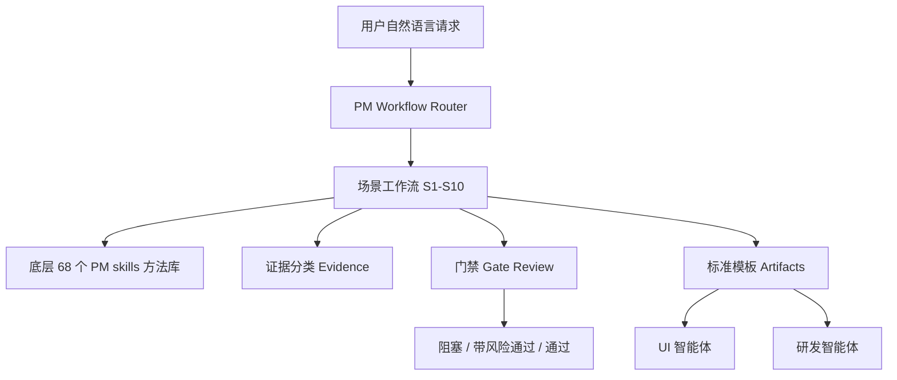

# PM Superpowers 插件设计说明

## 设计目标

PM Superpowers 的目标是把中国团队里产品经理的高频工作变成可学习、可执行、可检查、可交接的中文标准工作流。

它重点解决四类问题：

- 新同事不知道产品工作应该从哪里开始。
- 老同事输出方式不统一，PRD、路线图、指标、上线材料质量不稳定。
- 很多需求没想清楚就进入设计或研发，导致下游返工。
- 底层 PM skills 是单点方法，缺少场景化串联和门禁。

## 插件边界

PM Superpowers 内置 68 个 PM 方法技能，但不重复实现、不合并重写这些方法技能。插件边界分两层：

- 方法库层：68 个 PM method skills，保留独立技能目录，负责具体产品方法。
- 场景治理层：18 个 PM Superpowers 技能，负责场景识别、流程编排、门禁、模板和交接。

PM Superpowers 的上层能力包括：

- 识别场景。
- 选择工作流。
- 调用或引用合适的底层 PM skills。
- 检查证据、假设、范围、指标和风险。
- 输出标准模板。
- 判断是否能交给 UI 智能体和研发智能体。
- 默认用中文输出用户可见的结论、模板和交付产物。
- 初始化产品项目工作区，沉淀 `AGENTS.md`、产品上下文、决策记录、证据表、风险清单和交接状态。

内置 68 个 PM method skills 是方法库，PM Superpowers 场景/治理技能是流程系统。物理发布上放在一个插件里，是为了让团队成员只安装一次；逻辑设计上仍然分层维护。

为了保护底层方法技能的原子能力，PM Superpowers 保留 PM method skills 直通契约：当用户明确点名 `market-sizing`、`ab-test-analysis`、`interview-script` 等方法技能时，可以直接使用该方法技能，不强制套完整场景工作流。只有当方法产物要进入 PRD、路线图承诺、UI/研发交接或上线计划时，才追加 `pm-gate-review` 或 `downstream-readiness`。

## 分层架构



## 十个场景和插件技能

| 场景 | 插件技能 | 解决的问题 |
| --- | --- | --- |
| S0 模糊需求澄清 | `pm-intake-triage` | 先把一句话想法变成可处理的产品 brief |
| S1 新产品探索 | `new-product-discovery` | 从机会、用户、问题、假设到验证计划 |
| S2 现有产品优化 | `existing-product-optimization` | 从症状、数据和反馈定位优化方向 |
| S3 反馈转路线图 | `feedback-to-roadmap` | 把杂乱反馈变成主题、机会和路线图候选 |
| S4 PRD 标准化 | `prd-standardization` | 产出可评审、可设计、可开发的需求文档 |
| S5 用户研究 | `user-research` | 让访谈和洞察服务明确产品决策 |
| S6 优先级路线图 | `prioritization-roadmap` | 把候选需求排成可解释的 outcome roadmap |
| S7 指标和实验 | `metrics-experiments` | 把产品问题变成指标、实验和数据判断 |
| S8 战略商业模式 | `strategy-business-model` | 支持方向、市场、定位、商业模式和定价决策 |
| S9 上线准备 | `launch-readiness` | 检查产品、GTM、数据、支持和风险是否就绪 |
| S10 PM 运营 | `pm-operations` | 支持会议、复盘、sprint、OKR、行动项和决策记录 |

## 横向控制技能

除了十个场景，还需要八个横向技能：

- `pm-workflow-router`：入口路由。
- `pm-intake-triage`：模糊需求澄清。
- `evidence-classifier`：证据和假设分类。
- `pm-gate-review`：统一门禁。
- `pm-decision-log`：决策记录。
- `downstream-readiness`：交给 UI 或研发前的 readiness 检查。
- `post-launch-learning`：上线后的学习闭环。
- `pm-project-initializer`：初始化产品项目工作区和 `AGENTS.md`。

这些技能不是某个单一场景，而是所有场景都要使用的控制层。

## 产品项目工作区

PM Superpowers 支持在用户项目中初始化标准产品工作区。它不会在用户毫无请求时自动写入文件；当用户明确要求“初始化产品项目工作区”“创建 AGENTS.md”“按项目管理这个需求”时，`pm-project-initializer` 会创建或更新：

- `AGENTS.md`
- `product-space/context/product-context.md`
- `product-space/context/stakeholders.md`
- `product-space/decisions/decision-log.md`
- `product-space/evidence/evidence-table.md`
- `product-space/workflows/workflow-state.md`
- `product-space/risks/risk-register.md`
- `product-space/handoffs/downstream-readiness.md`

后续 agent 应优先读取这些文件，以便持续记录产品上下文、关键决策、证据、风险、门禁状态和下游交接情况。

## 门禁设计

门禁状态只有三种：

- `PASS`：可以进入下一步。
- `PASS_WITH_RISKS`：可以进入下一步，但风险要显式带着走。
- `BLOCKED`：不能继续，需要补齐关键输入。

典型阻塞：

- 没有目标用户。
- 没有问题陈述。
- 没有决策目标。
- 没有范围和非目标。
- 没有验收标准。
- 没有指标或观测方式。
- 要交给下游团队但缺少关键状态、边界条件或 owner。

## 68 个 PM skills 如何处理

现有 68 个 PM skills 按以下方式处理：

1. 内置：随 PM Superpowers 插件一起发布，用户不需要额外安装 `pm-skills`。
2. 保留：保留独立技能目录、技能名和原子方法职责，不合并成一个大技能。
3. 归类：按产品发现、战略、执行、市场研究、数据分析、GTM、增长、AI shipping、工具类分组。
4. 编排：每个场景工作流引用一组底层技能。
5. 治理：PM Superpowers 对底层技能产物做证据、门禁和交接检查。
6. 同步：插件开发人员通过 `scripts/sync_pm_skills.py` 从认可来源更新内置快照；同步脚本会自动注入中文输出要求。
7. 扩展：缺的是场景流、门禁、handoff 时，新增 PM Superpowers 场景/治理技能；缺的是独立产品方法时，新增或更新 PM method skill。

例如：

- `create-prd` 负责写 PRD 方法。
- `prd-standardization` 负责判断什么时候该写 PRD、写之前缺什么、写完能不能交给设计和研发。

这两个层级不冲突，反而互补。

## 行为回归契约

PM Superpowers 不只依赖静态格式校验，还维护一组行为回归契约，用来防止关键工作流退化。

当前行为回归覆盖：

- 模糊想法不能直接进入 PRD。
- 客户或销售请求不能照单进入路线图。
- 缺验收标准不能标记为可交给研发。
- 缺监控和回滚不能宣称上线准备完成。
- 用户明确点名 PM method skill 时允许直通。

回归用例位于：

```text
plugins/pm-superpowers/references/behavior-regression-cases.json
```

发版前运行：

```bash
python3 plugins/pm-superpowers/scripts/validate_behavior_regression.py
```

## 与 UI 和研发工作流串联

PM Superpowers 输出的产物应该能成为后续智能体输入：


交给 UI 前，至少要有：

- 目标用户。
- 用户流。
- 页面或功能范围。
- 关键状态和边界条件。
- 内容和术语。
- 约束和非目标。

交给研发前，至少要有：

- 清晰范围。
- 功能要求。
- 验收标准。
- 指标和埋点。
- 数据或接口假设。
- 风险、依赖和回滚方案。

## 为什么不是只写提示词

提示词适合一次性任务，但不适合团队规范。插件化有几个好处：

- 工作流可以被版本管理。
- 新人和老员工用同一套入口。
- 门禁和模板可以统一维护。
- 底层技能可以逐步扩展。
- 后续可以和 UI、研发、数据、运营插件串联。
