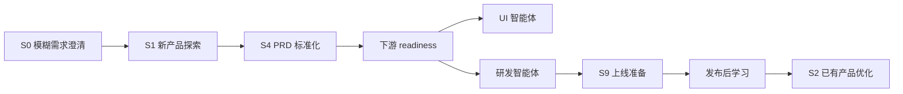
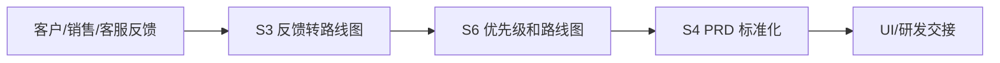
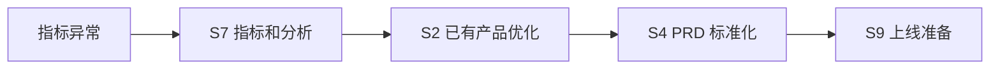

# PM Superpowers 高频场景深度手册

这份手册是给真实用户看的，不是给插件开发者看的。读者可以是刚入门的产品同事、从业务或项目转产品的同事，也可以是已经有经验但希望统一团队工作方式的产品经理。

这份手册要解决一个核心问题：当你拿到一件产品工作时，你到底应该怎么判断场景、怎么启动插件、怎么补齐信息、怎么判断产物是否合格、什么时候必须停下来。

## 先说清楚：产品工作不是从写 PRD 开始

很多新人接到任务后的第一反应是：“我要不要先写个 PRD？”  
但在真实工作里，PRD 往往不是第一步，而是中后段产物。

比如：

- 老板说“我们也要做 AI 助手”，这不是 PRD 场景，而是新产品探索。
- 客户说“要导出报表”，这不是立刻写导出功能，而是反馈转需求和问题还原。
- 用户说“这个页面不好用”，这不是立刻改 UI，而是已有产品优化。
- 研发问“这个需求到底怎么验收”，这才可能是 PRD 标准化。
- 功能已经做完准备发布，这不是继续补需求，而是上线 readiness。

PM Superpowers 的价值，就是先帮你判断“现在是什么产品场景”，再带你走正确工作流。

## 使用前先问自己五个问题

你每次打开插件前，先用人话回答这五个问题。回答得越清楚，插件越能直接进入工作流；回答不清楚，插件就应该先帮你澄清。

| 问题 | 通俗解释 | 如果答不清会怎样 |
| --- | --- | --- |
| 这件事从哪里来？ | 是老板想法、客户反馈、指标异常、会议结论，还是上线任务？ | 插件无法判断场景 |
| 这件事服务谁？ | 谁是用户、客户、内部角色或下游团队？ | 容易写出没人真正需要的需求 |
| 你想做成什么决策？ | 是决定做不做、先做哪个、怎么做、能不能上线，还是怎么复盘？ | 产物会变成泛泛分析 |
| 现在最不确定的是什么？ | 用户、问题、证据、方案、范围、指标、风险，哪个最不清楚？ | 容易跳过关键思考 |
| 下游是谁？ | 给自己继续探索、给设计、给研发、给销售客服，还是给管理层？ | 输出格式和深度会错 |

如果这五个问题里有两个以上答不清，不要直接让插件写 PRD。先让插件走 `pm-intake-triage` 做澄清。

## 场景地图：你现在大概率属于哪一类

| 你现在遇到的情况 | 应该进入的场景 | 不要急着做什么 |
| --- | --- | --- |
| 只有一句想法，不知道怎么推进 | S0 模糊需求澄清 | 不要直接写 PRD |
| 想做一个新产品、新模块、新 AI 能力 | S1 新产品或新功能探索 | 不要直接列功能 |
| 已有功能效果不好、用户投诉、指标异常 | S2 已有产品优化 | 不要直接改版 |
| 有很多客户反馈、销售需求、客服工单 | S3 反馈转路线图 | 不要照单全收 |
| 已经准备写需求给设计或研发 | S4 PRD 标准化 | 不要缺验收标准 |
| 要访谈用户或总结访谈 | S5 用户研究 | 不要问引导性问题 |
| 很多需求不知道先做哪个 | S6 优先级和路线图 | 不要只按声音大小排序 |
| 不知道看什么指标、怎么设计实验 | S7 指标和实验 | 不要为了看数据而看数据 |
| 要判断方向、市场、定位、商业模式 | S8 战略和商业模式 | 不要只做竞品功能对比 |
| 功能快上线，要检查风险和准备 | S9 上线准备和 GTM | 不要把研发完成当上线完成 |
| 会议、复盘、sprint、OKR、行动项 | S10 PM 日常运营协作 | 不要只写流水账 |

## 如何理解 `BLOCKED`

插件提示 `BLOCKED` 不是在拒绝你，而是在保护你。

产品工作里最危险的情况，是信息没想清楚，但文档写得很完整。这样的 PRD 看起来专业，实际会把错误传给设计、研发、测试、销售和客服。

以下情况就应该 `BLOCKED`：

- 不知道用户是谁。
- 不知道问题是什么。
- 不知道要支持什么决策。
- 没有证据，却要求给确定结论。
- 没有范围和验收标准，却要交给研发。
- 没有关键状态和用户流，却要交给 UI。
- 没有监控和回滚，却要上线。

好的产品经理不是永远往前推，而是知道什么时候该停下来补信息。

## S0：模糊需求澄清

### 你可能正遇到的情况

你拿到的不是一个清楚需求，而是一团混合信息：

- “老板说我们也要做一个 AI 助手。”
- “客户说想要一个报表。”
- “销售说这个功能很重要。”
- “竞品有这个，我们是不是也要做？”
- “帮我看看这个产品怎么做。”

这些话都不能直接进入 PRD。它们只是产品工作的入口。

### 用通俗话解释这个场景

S0 就像医生问诊。用户说“我不舒服”，医生不能马上开刀，必须先问哪里不舒服、持续多久、有没有检查结果、会影响什么。

产品也是一样。别人说“我要一个功能”，产品经理不能马上写功能，必须先搞清楚：

- 谁要？
- 为什么要？
- 真正痛点是什么？
- 有多重要？
- 要支持什么业务决策？
- 下一步应该做调研、看数据、写 PRD，还是排优先级？

### 这个场景的目标

S0 的目标不是解决最终问题，而是把模糊输入变成清楚的产品任务。

最终你应该得到：

- 这件事的背景。
- 目标用户或客户。
- 当前已知事实。
- 当前假设。
- 推荐进入哪个场景。
- 继续推进前缺什么信息。

### 你应该怎么对插件说

```text
我现在只有一个比较模糊的产品想法，还不知道该走什么流程。请先按模糊需求澄清处理，帮我判断这是哪个产品场景，并列出继续推进前必须补齐的信息。
```

### 插件应该怎么做

1. 先判断这件事来自哪里。
2. 再问清楚用户、问题、目标、证据、下游。
3. 把事实、假设、观点和承诺分开。
4. 推荐进入 S1-S10 中的哪一个场景。
5. 如果信息不足，明确写出 `BLOCKED` 和缺口。

### 学习者最容易犯的错

最常见的错误是“觉得自己应该立刻有答案”。其实 S0 阶段最重要的是提问，不是回答。

错误做法：

```text
老板想做 AI 助手，那我先写一个 AI 助手 PRD。
```

正确做法：

```text
老板想做 AI 助手，我先判断目标用户是谁、要解决什么问题、有没有用户证据、是探索场景还是战略场景。
```

### 合格产物长什么样

一个合格的 S0 产物应该像这样：

```text
当前判断：这是一个新产品/新功能探索场景，而不是 PRD 场景。

已知信息：
- 公司希望探索 AI 助手能力。
- 当前没有明确目标用户。
- 当前没有用户问题证据。

关键假设：
- 用户可能需要 AI 帮助完成数据分析。
- 该需求可能来自竞品压力，而非用户真实痛点。

阻断项：
- 目标用户不清楚。
- 使用场景不清楚。
- 成功标准不清楚。

下一步：
- 先进入 S1 新产品探索，补齐用户、问题、假设和验证计划。
```

## S1：新产品或新功能探索

### 你可能正遇到的情况

你或团队想做一个新东西：

- 新产品。
- 新模块。
- 新 AI 能力。
- 新商业化能力。
- 新用户场景。
- 新市场机会。

看起来很有想象空间，但还不知道用户是不是真的需要。

### 用通俗话解释这个场景

S1 不是“把想法写成需求”，而是“证明这个想法值得继续”。

很多新产品失败，不是因为研发做不出来，而是因为一开始就没证明用户真的有这个问题。S1 阶段最重要的是把热情变成假设，把假设变成验证。

### 产品经理真正要想清楚什么

你要回答的不是“这个功能怎么做”，而是：

- 谁会在什么情况下需要它？
- 这个问题现在怎么被解决？
- 现有解决方式哪里不好？
- 用户为什么会切换到我们的方案？
- 如果只能验证一个假设，应该验证哪个？
- MVP 是为了验证什么，而不是为了包含多少功能？

### 必须准备的信息

最少要有：

- 初步目标用户。
- 典型使用场景。
- 想解决的问题。
- 业务上为什么关心这件事。
- 当前证据或假设。
- 希望做出的决策：继续探索、做 MVP、放弃，还是进入 PRD。

### 你应该怎么对插件说

```text
我们想做一个面向销售团队的 AI 客户跟进助手，目前还只是想法。请按新产品探索场景处理：先帮我明确目标用户、核心场景、用户问题、关键假设和验证计划，不要直接写 PRD。
```

### 插件工作流

1. `new-product-discovery`：建立产品探索 brief。
2. `user-segmentation`：把“用户”拆成具体人群。
3. `job-stories`：写清楚用户在什么情境下想完成什么任务。
4. `opportunity-solution-tree`：把机会、方案和实验分开。
5. `identify-assumptions-new`：识别关键假设。
6. `prioritize-assumptions`：找出最危险、最该验证的假设。
7. `brainstorm-experiments-new`：设计低成本验证。
8. `pm-gate-review`：判断是否能进入 PRD。

### 小案例

业务说：“我们要做 AI 客户跟进助手。”

新人可能会直接列功能：

- 自动总结客户。
- 自动生成跟进计划。
- 自动提醒销售。
- 自动写邮件。

但这还不是产品探索。正确拆解应该是：

- 目标用户：新销售、成熟销售、销售主管，谁最需要？
- 场景：客户会议后、商机推进中、流失预警时，哪个最痛？
- 问题：销售是不知道下一步做什么，还是信息太分散，还是主管无法管理过程？
- 替代方案：现在用 CRM、表格、销售自己记笔记，还是主管周会检查？
- 核心假设：AI 生成的跟进建议足够可信，销售愿意采用。
- 验证实验：先拿 20 个历史商机做人工模拟，看销售是否认可建议。

### 什么时候必须停下来

以下情况不能进入 PRD：

- 目标用户只写“所有销售”。
- 问题只写“提升效率”，没有具体场景。
- 没有替代方案分析。
- 没有关键假设排序。
- MVP 包含太多功能，无法说明验证目标。
- 只是因为竞品有，所以我们也要有。

### 好产物标准

好的 S1 产物应该让评审人看完后知道：

- 为什么这是一个值得探索的问题。
- 谁最痛。
- 当前证据强不强。
- 哪些是假设。
- 先验证什么。
- MVP 不做什么。
- 下一步是否应该进入 PRD。

### 交给 UI 或研发前要注意

S1 结束后通常还不能直接给研发。要先转成 S4 PRD 标准化，并通过 `downstream-readiness`。

如果只是探索结果，最多可以交给 UI 做低保真原型或概念验证，不应该直接要求研发排期。

## S2：已有产品优化

### 你可能正遇到的情况

产品已经存在，但表现不好：

- 用户不用。
- 转化低。
- 留存差。
- 操作慢。
- 投诉多。
- 某个流程一直卡住。

团队很容易说：“那我们改版吧。”  
但改版通常不是第一步，诊断才是第一步。

### 用通俗话解释这个场景

S2 像修一台机器。机器慢了，不能马上换外壳，要先看是电源、线路、零件、使用方式，还是外部环境出了问题。

已有产品优化也一样。用户说“不好用”，可能是：

- 找不到入口。
- 不理解文案。
- 权限不够。
- 操作太多。
- 数据加载慢。
- 业务规则不符合预期。
- 根本没有足够动机使用。

### 产品经理真正要想清楚什么

你要回答：

- 现象是什么？
- 发生在哪些用户身上？
- 发生在哪个流程节点？
- 当前基线是多少？
- 目标改善到什么程度？
- 根因可能是什么？
- 哪些方案可以低成本验证？

### 必须准备的信息

- 已有功能或流程。
- 当前症状。
- 受影响用户。
- 数据或反馈证据。
- 基线指标。
- 期望改善目标。

### 你应该怎么对插件说

```text
我们的新用户 onboarding 完成率只有 28%，用户反馈流程太长。请按已有产品优化场景处理，先诊断问题发生在哪些步骤，再提出方案和实验计划。
```

### 插件工作流

1. `existing-product-optimization`：定义症状、用户和影响范围。
2. `customer-journey-map`：还原用户路径。
3. `metrics-dashboard` 或 `cohort-analysis`：看数据。
4. `evidence-classifier`：区分事实、信号和意见。
5. `brainstorm-ideas-existing`：生成多个解决方案。
6. `brainstorm-experiments-existing`：设计实验。
7. `metrics-experiments`：定义指标和护栏。
8. `pm-gate-review`：判断是否能进入 PRD 或 sprint。

### 小案例

用户说：“导出功能不好用。”

错误理解：

```text
我们把导出按钮做大一点。
```

正确拆解：

- 用户找不到导出入口吗？
- 用户不知道导出后在哪里下载吗？
- 导出太慢吗？
- 导出的格式不对吗？
- 权限限制导致不能导出吗？
- 只有大客户有问题，还是所有用户都有问题？
- 投诉集中在哪类用户？

不同根因对应完全不同方案。按钮变大可能只解决入口问题，不能解决格式、权限和性能问题。

### 什么时候必须停下来

以下情况不能进入方案：

- 只有“不好用”，没有具体症状。
- 没有受影响用户。
- 没有流程节点。
- 没有基线。
- 没有数据或用户证据。
- 团队已经定了方案，但没人能说清问题。

### 好产物标准

好的 S2 产物应该包括：

- 当前问题定义。
- 基线指标。
- 用户路径卡点。
- 证据表。
- 可能根因。
- 备选方案。
- 实验计划。
- 成功指标和护栏指标。

### 交给 UI 或研发前要注意

交给 UI 前，要说明“当前体验哪里有问题、希望用户行为怎么变化”。  
交给研发前，要说明“改什么、为什么、如何验证、如何回滚”。

## S3：反馈转路线图

### 你可能正遇到的情况

你手里有很多反馈：

- 销售说客户都要这个。
- 客服工单里出现很多抱怨。
- 大客户要求定制。
- 用户访谈里提了很多建议。
- 需求池里堆了几十上百条。

这时最危险的是把反馈当需求，把需求池当路线图。

### 用通俗话解释这个场景

用户反馈像矿石，不是金子。产品经理要做的是提炼：去掉噪声，识别模式，找到真正有价值的问题。

客户说“我要 Excel 导出”，背后可能是：

- 他要做内部汇报。
- 他要和财务系统对账。
- 他不信任系统内报表。
- 他要离线处理数据。

如果你只做导出，可能错过了真正问题。

### 产品经理真正要想清楚什么

你要回答：

- 反馈来自谁？
- 是单个客户，还是一类用户？
- 频率有多高？
- 影响收入、留存、满意度还是效率？
- 是功能请求，还是问题信号？
- 是平台能力，还是定制需求？
- 做了之后对路线图有什么影响？

### 必须准备的信息

- 原始反馈。
- 反馈来源。
- 用户或客户类型。
- 频率或严重程度。
- 客户价值或业务影响。
- 当前路线图目标。
- 资源约束。

### 你应该怎么对插件说

```text
下面是 50 条销售和客服反馈。请按反馈转路线图场景处理，先聚类主题，识别真实问题和用户群，再按影响、频率、客户价值、成本和战略匹配输出路线图候选。
```

### 插件工作流

1. `feedback-to-roadmap`：标准化反馈。
2. `evidence-classifier`：标注原话、信号、假设、意见。
3. `analyze-feature-requests`：聚类需求主题。
4. `sentiment-analysis`：辅助判断情绪和严重度。
5. `prioritize-features`：初步排序。
6. `outcome-roadmap`：转成结果导向路线图。
7. `pm-decision-log`：记录做、暂缓、不做的理由。

### 小案例

销售反馈：

```text
3 个大客户都要求支持自定义审批流。
```

不要马上结论：

```text
自定义审批流优先级最高。
```

先拆：

- 这 3 个客户是什么行业？
- 他们的审批复杂度是否代表目标市场？
- 是因为我们流程太硬，还是客户内部管理特殊？
- 这个需求能平台化吗？
- 做了会不会拖慢其他核心路线图？
- 不做会影响续费或成交吗？

### 什么时候必须停下来

以下情况不能排路线图：

- 没有原始反馈。
- 不知道来源。
- 没有频率。
- 不知道代表什么用户群。
- 不知道业务影响。
- 只因为大客户提出，就默认全体用户需要。

### 好产物标准

好的 S3 产物应该包括：

- 反馈原文或摘要。
- 来源和用户分群。
- 主题聚类。
- 真实问题。
- 证据强度。
- 优先级排序。
- 进入路线图的理由。
- 暂缓或不做的理由。

### 交给下游前要注意

S3 的结果通常不是直接给研发，而是先进入 S6 优先级路线图，或对入选项目进入 S4 PRD。

## S4：PRD 标准化

### 你可能正遇到的情况

你已经比较明确要做什么，需要把它交给设计、研发、测试或评审。

典型情况：

- “帮我写个需求给研发。”
- “这个需求下周评审。”
- “研发说看不懂需求。”
- “设计需要知道页面状态。”
- “测试问怎么验收。”

### 用通俗话解释这个场景

PRD 不是把你脑子里的功能写下来，而是和下游团队签一份“共同理解的合同”。

好 PRD 要让不同角色都能得到自己需要的信息：

- 设计知道用户要完成什么任务。
- 研发知道功能边界和数据逻辑。
- 测试知道怎么验收。
- 业务知道为什么做、做完看什么指标。
- 产品自己知道哪些问题还没定。

但 PRD 不应该只有一种模板。一个后台配置需求、一个页面改版需求、一个 A/B 实验需求、一个接口需求，所需信息不一样。PRD 标准化的重点不是把所有字段填满，而是先判断这是什么类型的 PRD，再选择适用模块。

### 产品经理真正要想清楚什么

你要回答：

- 这次是轻量需求、标准功能、UI/体验、后台/接口/数据、优化实验，还是上线运营类 PRD？
- 为什么做？
- 给谁做？
- 解决什么问题？
- 成功怎么算？
- 做什么？
- 不做什么？
- 有哪些状态、权限、异常和边界？
- 研发完成后怎么验收？

### 必须准备的信息

所有 PRD 都应该准备：

- 用户和场景。
- 问题和目标。
- 范围和非目标。
- 验收标准。

按场景选择准备：

- 涉及 UI 时，需要用户流程、页面范围、关键状态和文案。
- 涉及研发逻辑时，需要功能规则、数据规则、权限、接口和依赖。
- 涉及指标优化时，需要成功指标、护栏指标、实验或观测方式。
- 涉及上线运营时，需要配置规则、上线步骤、回滚方案和责任人。

### 你应该怎么对插件说

```text
我有一个需求草稿，准备交给设计和研发。请按 PRD 标准化场景处理：先做 PRD 门禁检查，如果信息不足就阻断；如果足够，再输出标准 PRD、用户故事、验收标准和下游交接检查。
```

### 插件工作流

1. `prd-standardization`：做 PRD 前置检查。
2. `create-prd`：生成 PRD 主体。
3. `job-stories` 或 `user-stories`：表达用户需求。
4. `test-scenarios`：补齐测试场景。
5. `pre-mortem`：识别风险。
6. `pm-gate-review`：判断能否进入设计或研发。
7. `downstream-readiness`：检查 UI/研发交接是否足够。

### 小案例

需求草稿：

```text
做一个用户批量导入功能。
```

这还不够。插件应该追问：

- 哪类用户要批量导入？
- 导入什么对象？
- 为什么现在要做？
- 单次导入多少条？
- 文件格式是什么？
- 重复数据怎么处理？
- 错误行怎么提示？
- 权限怎么控制？
- 如何验收成功？

如果这些不清楚，直接写 PRD 只会把问题传给研发。

### 什么时候必须停下来

以下情况不能交给研发：

- 没有目标用户。
- 没有问题背景。
- 没有范围和非目标。
- 没有验收标准。
- 没有错误状态。
- 没有权限和边界。
- 没有指标或埋点要求。

### 好产物标准

好的 PRD 应该包括：

- 背景。
- 目标用户。
- 用户问题。
- 目标和指标。
- 范围和非目标。
- 用户流程。
- 功能要求。
- 页面或状态要求。
- 验收标准。
- 埋点。
- 风险和开放问题。

这些不是所有 PRD 都必填。适用就写清楚；不适用就写“不适用”和原因。例如：

- 后台接口需求可以没有页面状态，但必须有接口、权限、数据规则和验收标准。
- 文案小改可以没有实验设计，但必须有修改范围、上线位置和验收方式。
- A/B 实验可以没有复杂 UI 设计，但必须有指标、实验分流、观察周期和停止标准。
- 运营配置需求可以没有用户故事，但必须有配置项、影响范围、负责人和回滚方案。

### 交给 UI 或研发前要注意

如果要给 UI，必须有用户流、页面范围、关键状态和内容要求。  
如果要给研发，必须有功能边界、验收标准、数据要求、埋点、依赖和风险。

## S5：用户研究

### 你可能正遇到的情况

你想了解用户：

- 为什么不用？
- 为什么流失？
- 为什么不会配置？
- 他们到底怎么工作？
- 他们愿不愿意付费？
- 某个需求是否真的存在？

这时你需要用户研究，而不是问用户“你喜不喜欢这个功能”。

### 用通俗话解释这个场景

用户研究不是让用户替你设计产品，而是理解用户真实行为。

用户说“我会用”不一定真的会用。  
用户说“这个功能不错”也不等于愿意付费。  
更可靠的是过去行为、真实场景、现有替代方案和具体痛点。

### 产品经理真正要想清楚什么

你要回答：

- 研究要支持什么决策？
- 应该找谁聊？
- 要了解过去行为，还是当前痛点？
- 哪些问题会引导用户？
- 访谈结果怎么转成产品行动？

### 必须准备的信息

- 研究目标。
- 研究要支持的决策。
- 目标受访者。
- 受访者筛选条件。
- 已有假设。
- 期望输出。

### 你应该怎么对插件说

```text
我们想了解企业管理员为什么没有完成权限配置。请按用户研究场景处理，先明确研究决策和受访者，再设计 45 分钟访谈脚本，问题要围绕过去行为，不要引导用户认可方案。
```

### 插件工作流

1. `user-research`：定义研究问题和决策用途。
2. `interview-script`：设计访谈脚本。
3. `summarize-interview`：总结访谈记录。
4. `evidence-classifier`：区分原话、事实、信号和假设。
5. `customer-journey-map`：还原用户路径。
6. `identify-assumptions-new`：形成后续假设。
7. 路由到 S1、S2、S3、S4 或 S7。

### 小案例

错误问题：

```text
如果我们做一个自动权限推荐功能，你会用吗？
```

这个问题会引导用户说“会”。更好的问法：

```text
上一次你配置权限是什么时候？
当时你要完成什么任务？
你怎么判断每个人应该有什么权限？
配置过程中最麻烦的一步是什么？
如果配置错了，会造成什么后果？
```

### 什么时候必须停下来

以下情况不能开始正式访谈：

- 不知道研究要支持什么决策。
- 不知道访谈对象是谁。
- 只想验证自己方案对不对。
- 问题明显引导用户。
- 没有记录用户原话。

### 好产物标准

好的研究产物应该包括：

- 研究目标。
- 受访者说明。
- 访谈脚本。
- 用户原话。
- 行为事实。
- 洞察。
- 置信度。
- 产品含义。
- 下一步行动。

### 交给下游前要注意

用户研究产物不能直接等同于需求。它通常要进入 S1 新产品探索、S2 已有产品优化或 S3 反馈转路线图，再变成 PRD。

## S6：优先级和路线图

### 你可能正遇到的情况

你手里有很多事情：

- 老板要一个方向。
- 销售要客户需求。
- 客服要修问题。
- 研发希望做技术债。
- 用户反馈一堆功能。
- 团队资源只有几个人。

这时你需要做取舍，而不是把所有东西都排进计划。

### 用通俗话解释这个场景

路线图不是购物清单，而是资源选择。  
好的路线图告诉团队：这个周期我们优先追求什么结果，为什么这些事情先做，为什么另一些事情先不做。

### 产品经理真正要想清楚什么

你要回答：

- 当前周期最重要的目标是什么？
- 每个候选项服务哪个目标？
- 影响哪些用户？
- 证据强不强？
- 成本和依赖是什么？
- 不做会有什么代价？
- 做了如何衡量结果？

### 必须准备的信息

- 候选事项。
- 规划周期。
- 业务目标。
- 资源约束。
- 评分标准。
- 相关方。

### 你应该怎么对插件说

```text
我们下季度有 18 个候选需求，但研发只能做 6 个。请按优先级和路线图场景处理，先确定评分口径，再输出排序、Now/Next/Later、暂缓理由和决策记录。
```

### 插件工作流

1. `prioritization-roadmap`：统一候选项颗粒度。
2. `prioritization-frameworks`：选择合适框架。
3. `prioritize-features`：评分排序。
4. `outcome-roadmap`：转成结果导向路线图。
5. `stakeholder-map`：识别相关方。
6. `pm-decision-log`：记录取舍。
7. `strategy-red-team`：挑战路线图盲点。

### 小案例

候选项：

- 大客户要求 SSO。
- 新用户希望简化 onboarding。
- 销售希望导出报表。
- 研发希望重构权限系统。

不能只看“谁催得急”。要看：

- 公司当前目标是提升成交还是提升激活？
- 哪个事项影响最大？
- 哪个事项证据最强？
- 哪个事项依赖最多？
- 哪个事项不做会造成最大损失？

### 什么时候必须停下来

以下情况不能输出正式路线图：

- 没有业务目标。
- 没有资源约束。
- 候选项描述不清。
- 评分口径不统一。
- 没有说明为什么不做某些事项。

### 好产物标准

好的路线图应该包括：

- 目标。
- 周期。
- 候选项。
- 评分框架。
- 排序。
- Now / Next / Later。
- 暂缓和不做清单。
- 风险和依赖。
- 决策记录。

### 交给下游前要注意

路线图不是 PRD。路线图确认后，近期要做的事项还要进入 S1/S2/S4 等场景，补齐探索、诊断或需求细节。

## S7：指标、数据分析和实验

### 你可能正遇到的情况

你想用数据判断产品：

- 这个功能有没有效果？
- 北极星指标是什么？
- 转化为什么下降？
- 实验能不能上线？
- 要看哪些数据？
- 要怎么写埋点需求？

### 用通俗话解释这个场景

指标不是报表装饰，而是决策工具。  
如果没有产品问题，数据分析就会变成“看一堆数字”。  
如果没有指标口径，实验结果就会变成“各说各话”。

### 产品经理真正要想清楚什么

你要回答：

- 这个数据问题服务什么决策？
- 用户什么行为代表获得价值？
- 主指标是什么？
- 护栏指标是什么？
- 当前基线是什么？
- 数据从哪里来？
- 成功或失败的判断标准是什么？

### 必须准备的信息

- 产品问题。
- 决策目标。
- 用户行为。
- 数据源或埋点情况。
- 当前基线。
- 成功阈值。
- 时间窗口。

### 你应该怎么对插件说

```text
这个功能上线后我们不知道怎么看效果。请按指标和实验场景处理，帮我定义主指标、护栏指标、埋点需求、成功阈值和上线后复盘方式。
```

### 插件工作流

1. `metrics-experiments`：明确产品问题和决策。
2. `north-star-metric`：定义核心指标。
3. `metrics-dashboard`：设计看板。
4. `sql-queries`：形成数据查询需求。
5. `cohort-analysis`：分析留存或分群。
6. `ab-test-analysis`：分析实验结果。
7. `post-launch-learning`：形成上线后决策。

### 小案例

团队说：

```text
我们要提升活跃。
```

这太粗。插件应该追问：

- 活跃是登录、浏览、创建、分享，还是完成核心任务？
- 哪个行为代表用户获得价值？
- 目标用户是哪一类？
- 当前基线是多少？
- 提升多少才算有效？
- 会不会牺牲留存、付费或体验？

### 什么时候必须停下来

以下情况不能给数据结论：

- 没有产品决策。
- 指标不能代表用户价值。
- 口径不清。
- 没有基线。
- 没有护栏指标。
- 实验没有样本量、周期或判断标准。

### 好产物标准

好的指标产物应该包括：

- 产品问题。
- 指标定义。
- 口径。
- 数据来源。
- 基线。
- 目标。
- 护栏指标。
- 分析或实验方案。
- 决策建议。

### 交给下游前要注意

交给研发前，要把埋点事件、属性、触发时机、数据质量要求写清楚。  
交给管理层前，要把结论置信度和行动建议写清楚。

## S8：战略和商业模式

### 你可能正遇到的情况

你面对的是方向性问题：

- 要不要进入某个市场？
- 要服务中小客户还是企业客户？
- 产品该怎么定位？
- 竞品很多，我们怎么差异化？
- 商业模式怎么定？
- 定价怎么设计？

### 用通俗话解释这个场景

战略不是一句愿景，也不是竞品功能表。  
战略是选择：选择服务谁，选择创造什么价值，选择怎么赚钱，也选择不做什么。

### 产品经理真正要想清楚什么

你要回答：

- 我们服务谁，不服务谁？
- 他们为什么需要我们？
- 现在用什么替代方案？
- 市场是否足够大？
- 我们凭什么赢？
- 商业模式是否成立？
- 哪些方向明确不做？

### 必须准备的信息

- 战略问题。
- 目标市场。
- 目标用户或客户。
- 当前产品能力。
- 竞争或替代方案。
- 商业约束。
- 时间尺度。
- 决策人。

### 你应该怎么对插件说

```text
我们考虑从中小客户转向企业客户。请按战略和商业模式场景处理，分析 ICP、市场机会、竞品、价值主张、商业模式、战略取舍和后续路线图。
```

### 插件工作流

1. `strategy-business-model`：明确战略问题。
2. `product-vision` 和 `product-strategy`：建立方向。
3. `market-segments` 和 `market-sizing`：判断市场。
4. `competitor-analysis`、`swot-analysis`、`pestle-analysis`、`porters-five-forces`：分析环境。
5. `business-model`、`monetization-strategy`、`pricing-strategy`：设计商业化。
6. `ideal-customer-profile` 和 `positioning-ideas`：明确客户和定位。
7. `strategy-red-team`：挑战战略假设。
8. 转成 OKR 和 outcome roadmap。

### 小案例

方向：

```text
我们要不要从 SMB 转向企业客户？
```

不能只看企业客户客单价高。还要看：

- 企业客户销售周期更长，团队是否承受得住？
- 产品是否具备权限、审计、安全、集成能力？
- 客服和交付体系是否跟得上？
- 这个转向会不会伤害现有中小客户体验？
- 我们的渠道是否能触达企业客户？

### 什么时候必须停下来

以下情况不能输出正式战略：

- 没有明确战略问题。
- 目标用户不清。
- 不知道替代方案。
- 只分析竞品功能，不分析价值主张。
- 没有商业模式。
- 没有明确不做什么。

### 好产物标准

好的战略产物应该包括：

- 战略问题。
- 目标市场。
- ICP。
- 市场规模。
- 竞品和替代方案。
- 价值主张。
- 差异化。
- 商业模式。
- 战略取舍。
- 风险和验证计划。

### 交给下游前要注意

战略不能直接交给研发。战略要先转成目标、路线图和具体场景工作，再进入 PRD 或实验。

## S9：上线准备和 GTM

### 你可能正遇到的情况

功能快上线了：

- 研发说做完了。
- 测试基本通过。
- 业务等着发布。
- 销售或客服要说明材料。
- 你担心上线出问题。

这时要做的是上线 readiness，不是继续补需求。

### 用通俗话解释这个场景

上线不是“代码合并”，而是“用户可用、风险可控、团队知道、数据可看、出事能退”。

很多事故不是因为功能没做，而是因为没有监控、没有回滚、客服不知道、销售讲错、用户被突然影响。

### 产品经理真正要想清楚什么

你要回答：

- 发布范围是什么？
- 哪些用户会受影响？
- 核心路径是否通过？
- 还有哪些阻断风险？
- 监控指标是什么？
- 出问题怎么回滚？
- 谁有权决定发布或暂停？
- 销售、客服、运营是否准备好？

### 必须准备的信息

- 发布范围。
- 目标用户。
- 上线时间。
- 测试结果。
- 风险清单。
- 监控指标。
- 回滚方案。
- 相关方 owner。

### 你应该怎么对插件说

```text
自助开票功能准备上线。请按上线准备场景处理，检查发布范围、核心路径、测试覆盖、风险、监控、回滚、客服销售同步和 release notes。
```

### 插件工作流

1. `launch-readiness`：建立上线清单。
2. `pre-mortem`：提前想象上线失败原因。
3. `test-scenarios`：检查测试覆盖。
4. `release-notes`：生成发布说明。
5. `gtm-strategy`、`gtm-motions`、`competitive-battlecard`：准备 GTM。
6. `shipping-artifacts`：汇总发布材料。
7. `pm-gate-review`：判断是否通过上线门禁。
8. `post-launch-learning`：设定上线后复盘。

### 小案例

功能：

```text
自助开票。
```

上线前必须问：

- 只有部分用户可见，还是全量开放？
- 发票信息错误怎么办？
- 开票失败怎么提示？
- 财务系统接口异常怎么办？
- 客服如何处理用户投诉？
- 是否有操作日志？
- 是否能回滚到人工开票？

### 什么时候必须停下来

以下情况不能上线：

- 核心路径没测完。
- 有 launch-blocking 风险。
- 没有监控指标。
- 没有回滚方案。
- 关键相关方没同步。
- 权限、数据、财务、安全风险没确认。

### 好产物标准

好的上线产物应该包括：

- 发布范围。
- readiness checklist。
- 测试覆盖。
- 风险分级。
- release notes。
- GTM 和沟通计划。
- 监控指标。
- 回滚方案。
- 发布后复盘计划。

### 交给下游前要注意

交给研发的是阻断风险、监控、回滚和待修问题。  
交给销售客服的是用户变化、FAQ、限制、话术和升级路径。

## S10：PM 日常运营和协作

### 你可能正遇到的情况

你每天都在处理这些事：

- 会议纪要。
- 需求评审。
- sprint planning。
- 版本复盘。
- OKR。
- 行动项追踪。
- 跨部门对齐。

这些事看起来琐碎，但决定团队执行质量。

### 用通俗话解释这个场景

好的 PM 运营不是“把会议记下来”，而是让团队知道：

- 决定了什么。
- 谁负责。
- 什么时候完成。
- 还有什么没定。
- 哪些问题要进入正式产品工作流。

### 产品经理真正要想清楚什么

你要回答：

- 这次协作的目标是什么？
- 哪些是事实？
- 哪些是讨论？
- 哪些已经决定？
- 哪些行动项有 owner 和 deadline？
- 哪些问题需要进入 S1-S9？

### 必须准备的信息

- 会议或项目背景。
- 参与方。
- 讨论内容。
- 已知决策。
- 行动项。
- 时间约束。

### 你应该怎么对插件说

```text
请按 PM 日常运营场景整理这次需求评审会议，输出背景、关键讨论、已做决策、行动项、owner、deadline、open questions，以及需要进入其他工作流的事项。
```

### 插件工作流

1. `pm-operations`：判断任务类型。
2. `summarize-meeting`：提取讨论、决策和行动项。
3. `pm-decision-log`：记录决策。
4. `stakeholder-map`：识别相关方。
5. `sprint-plan`、`retro` 或 `brainstorm-okrs`：生成对应材料。
6. 把未解决产品问题重新路由到 S1-S9。

### 小案例

会议纪要里写：

```text
大家讨论了导出功能，研发评估下周开始。
```

这不合格。合格纪要应该写：

```text
决策：导出功能进入本季度 roadmap，但本期只支持 CSV，不支持 Excel 和自定义字段。
Owner：产品 A 负责补 PRD，研发 B 负责技术评估。
截止时间：本周五完成 PRD 门禁检查。
Open question：大客户是否必须 Excel，需要销售补充客户名单和收入影响。
下一步工作流：进入 S4 PRD 标准化；Excel 诉求进入 S3 反馈转路线图。
```

### 什么时候必须停下来

以下情况不能算完成：

- 行动项没有 owner。
- 行动项没有截止时间。
- 决策没有记录。
- OKR 没有可衡量 KR。
- sprint plan 没有容量和风险。
- 复盘没有后续行动。

### 好产物标准

好的运营产物应该包括：

- 背景。
- 关键讨论。
- 已做决策。
- 行动项。
- owner。
- deadline。
- 风险。
- open questions。
- 需要进入其他场景的事项。

### 交给下游前要注意

会议里产生的新想法进入 S1。  
指标问题进入 S7。  
上线风险进入 S9。  
需求不清进入 S0 或 S4。

## 场景之间如何串起来

真实产品工作通常不是单点，而是一条链路。

新想法常见链路：



反馈类需求常见链路：



指标问题常见链路：



判断原则：优先回到“最早还没想清楚”的环节。  
如果用户要求写 PRD，但用户和问题都不清楚，就不要强行进入 S4，而要回到 S0 或 S1。

## 三类必须坚持的门禁

### 问题门禁

进入方案或 PRD 前必须知道：

- 用户是谁。
- 问题是什么。
- 有什么证据。
- 业务目标是什么。
- 哪些是假设。

### 执行门禁

进入 UI 或研发前必须知道：

- 范围。
- 非目标。
- 用户流。
- 状态和边界。
- 验收标准。
- 指标和埋点。

### 上线门禁

发布前必须知道：

- 核心路径是否通过。
- 风险是否关闭。
- 监控是否可用。
- 回滚是否可执行。
- 相关方是否同步。

## 学习者如何练习

建议团队用四次训练掌握：

### 第一次：场景识别

拿 20 条真实输入，让大家判断 S0-S10。目标不是答对所有，而是说清楚为什么。

### 第二次：阻断训练

拿低质量需求，让大家判断为什么不能继续。训练重点是学会说：

```text
现在不能进入 PRD，因为目标用户、问题和验收标准都不清楚。
```

### 第三次：产物训练

选一个真实需求，从 S0 跑到 S4，再做 `downstream-readiness`。训练目标是让大家看到一个需求如何从模糊到可交接。

### 第四次：上线和复盘训练

拿一个已上线功能，从 S9 做上线检查，再做发布后学习，最后回到 S2 优化。

## 最小掌握标准

一个刚接触产品工作的同事，至少要做到：

- 能判断当前属于哪个场景。
- 知道 PRD 不是所有工作的第一步。
- 知道反馈不是需求，想法不是需求，方案不是问题。
- 能把事实、用户原话、信号、假设、意见和承诺分开。
- 知道什么时候应该 `BLOCKED`。
- 能按模板输出产品 brief、PRD、路线图、指标方案或上线清单。
- 能判断产物是否可以交给 UI 或研发。

做到这些，产品工作就不再是凭感觉写文档，而是按场景推进、按门禁检查、按模板交付。
